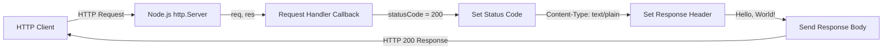
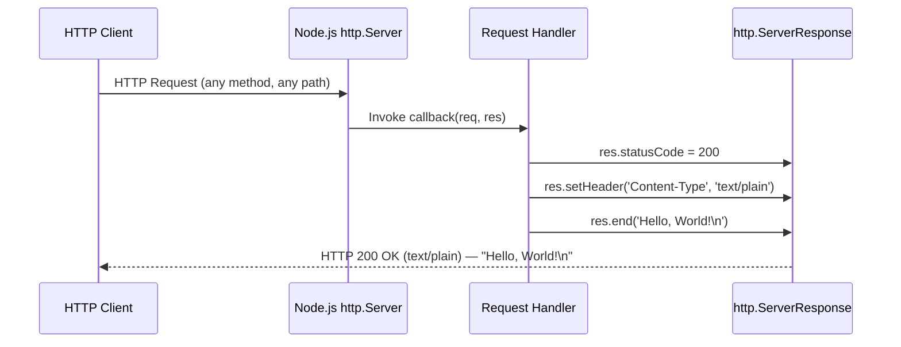

# Hello World Server

> A minimal, zero-dependency HTTP server built with Node.js — responding with "Hello, World!" to every request.


---

## Table of Contents

- [Features](#features)
- [Prerequisites](#prerequisites)
- [Installation](#installation)
- [Usage](#usage)
- [API Documentation](#api-documentation)
- [Architecture Overview](#architecture-overview)
- [Project Structure](#project-structure)
- [Configuration](#configuration)
- [Deployment Guide](#deployment-guide)
- [Troubleshooting](#troubleshooting)
- [Contributing](#contributing)
- [License](#license)

---

## Features

- **Zero-dependency architecture** — uses only the Node.js built-in `http` module; no external packages required at runtime
- **Single-command startup** — run `node server.js` and the server is live
- **Stateless request-response design** — every request receives the same response with no side effects
- **Lightweight** — the entire server implementation is ~14 lines of code in a single file

---

## Prerequisites

| Requirement | Version  | Notes                                      |
|-------------|----------|--------------------------------------------|
| Node.js     | v20.x+   | Required runtime environment               |
| npm         | v11.x+   | Ships with Node.js; used for dev tooling   |

No additional tools, frameworks, or system-level dependencies are needed.

Verify your installation:

```bash
node --version
# Expected: v20.x.x or later

npm --version
# Expected: v11.x.x or later
```

---

## Installation

1. **Clone the repository:**

   ```bash
   git clone <repository-url>
   cd hao-backprop-test
   ```

2. **Install development dependencies (optional):**

   ```bash
   npm install
   ```

   This installs **only** devDependencies (e.g., `jsdoc` for documentation generation). There are **zero runtime dependencies** — the server runs without any `npm install` step.

3. **Start the server:**

   ```bash
   node server.js
   ```

   Or, using the npm start script:

   ```bash
   npm start
   ```

> **⚠️ Note — `main` field discrepancy:** The `package.json` file declares `"main": "index.js"`, but the actual server entry point is **`server.js`**. This means `require('hello_world')` would fail if used as an npm package. The correct command to start the server is always `node server.js` (or `npm start`). This discrepancy is documented here to prevent confusion.
>
> *Source: package.json:5, server.js:1–14*

---

## Usage

### Starting the Server

```bash
node server.js
```

**Expected console output:**

```
Server running at http://127.0.0.1:3000/
```

*Source: server.js:12–13*

### Sending Requests

**Basic GET request:**

```bash
curl http://127.0.0.1:3000/
```

**Expected output:**

```
Hello, World!
```

**Verbose request showing response headers:**

```bash
curl -v http://127.0.0.1:3000/
```

**Expected output (relevant headers):**

```
< HTTP/1.1 200 OK
< Content-Type: text/plain
< Date: ...
< Connection: keep-alive
< Keep-Alive: timeout=5
<
Hello, World!
```

### Stopping the Server

Press `Ctrl+C` in the terminal where the server is running.

---

## API Documentation

The server exposes a single, universal endpoint that responds identically to **all** HTTP methods and **all** URL paths.

### Endpoint Specification

| Property       | Value                              |
|----------------|------------------------------------|
| **URL**        | `http://127.0.0.1:3000/` (any path) |
| **Method**     | Any (GET, POST, PUT, DELETE, PATCH, etc.) |
| **Request Body** | Ignored                          |
| **Response Status** | `200 OK`                      |
| **Response Content-Type** | `text/plain`           |
| **Response Body** | `Hello, World!\n`               |

*Source: server.js:6–10*

### Request/Response Example

```bash
# All of these return the same response:
curl http://127.0.0.1:3000/
curl http://127.0.0.1:3000/any/path
curl -X POST http://127.0.0.1:3000/
curl -X DELETE http://127.0.0.1:3000/foo
```

**Response (identical for all):**

```
HTTP/1.1 200 OK
Content-Type: text/plain

Hello, World!
```

> **Note:** The server does not implement routing, middleware, or request parsing. Every request — regardless of method, path, headers, or body — receives the same `200 OK` plain-text response.

---

## Architecture Overview

### Request-Response Flow



### Request-Response Sequence



---

## Project Structure

```
.
├── README.md           # Project documentation (this file)
├── server.js           # HTTP server implementation (~14 lines)
├── package.json        # npm package manifest and scripts
└── package-lock.json   # npm dependency lock file
```

| File               | Description                                                                                      |
|--------------------|--------------------------------------------------------------------------------------------------|
| `README.md`        | Comprehensive project documentation covering setup, usage, API, deployment, and troubleshooting  |
| `server.js`        | The complete HTTP server — imports `http`, defines hostname/port, creates the server, and listens |
| `package.json`     | npm manifest with project metadata, start/docs scripts, and devDependencies                      |
| `package-lock.json`| Auto-generated lock file ensuring deterministic dependency installs                               |

---

## Configuration

The server's behavior is controlled by two constants defined in `server.js`:

| Constant   | Type     | Default       | Description                                                 |
|------------|----------|---------------|-------------------------------------------------------------|
| `hostname` | `string` | `'127.0.0.1'` | IP address the server binds to (loopback / localhost only)  |
| `port`     | `number` | `3000`         | TCP port the server listens on for incoming connections     |

*Source: server.js:3–4*

> **⚠️ Important:** These values are **hardcoded** in `server.js`. To change them, edit the source file directly. The server does not support environment variable configuration.

To make the server accessible from other machines on the network, change `hostname` to `'0.0.0.0'`:

```javascript
// server.js — change this line:
const hostname = '0.0.0.0'; // Bind to all network interfaces
```

---

## Deployment Guide

### Local Development

```bash
node server.js
```

The server binds to `127.0.0.1` (loopback interface), making it accessible **only from the local machine**. This is ideal for development and testing.

> **⚠️ Network accessibility:** By default, the server is **NOT** accessible from other machines on the network. The `127.0.0.1` binding restricts connections to localhost only. For network-accessible deployments, change `hostname` in `server.js` to `'0.0.0.0'`.

### Production with PM2

[PM2](https://pm2.keymetrics.io/) is a production-grade process manager for Node.js that provides automatic restarts, clustering, and monitoring.

```bash
# Install PM2 globally
npm install -g pm2

# Start the server with PM2
pm2 start server.js --name hello-world

# Check server status
pm2 status

# View logs
pm2 logs hello-world

# Stop the server
pm2 stop hello-world
```

### Production with systemd

Create a systemd service file at `/etc/systemd/system/hello-world.service`:

```ini
[Unit]
Description=Hello World Node.js HTTP Server
After=network.target

[Service]
Type=simple
User=node
WorkingDirectory=/opt/hello-world
ExecStart=/usr/bin/node server.js
Restart=on-failure
RestartSec=10
StandardOutput=journal
StandardError=journal

[Install]
WantedBy=multi-user.target
```

Then enable and start the service:

```bash
sudo systemctl daemon-reload
sudo systemctl enable hello-world
sudo systemctl start hello-world
sudo systemctl status hello-world
```

### Docker Containerization

Create a `Dockerfile` in the project root:

```dockerfile
FROM node:20-alpine

WORKDIR /usr/src/app

COPY server.js .

EXPOSE 3000

CMD ["node", "server.js"]
```

> **⚠️ Docker networking note:** Before building the Docker image, change `hostname` in `server.js` from `'127.0.0.1'` to `'0.0.0.0'`. Inside a container, `127.0.0.1` refers to the container's own loopback and will **not** be accessible from the host or other containers.

Build and run:

```bash
# Build the image
docker build -t hello-world-server .

# Run the container
docker run -d -p 3000:3000 --name hello-world hello-world-server

# Verify it works
curl http://localhost:3000/
```

---

## Troubleshooting

### Port Already in Use (EADDRINUSE)

If you see the error `Error: listen EADDRINUSE: address already in use 127.0.0.1:3000`, another process is occupying port 3000.

**Find and terminate the process:**

```bash
# Find the process using port 3000
lsof -i :3000

# Kill the process by PID
kill -9 <PID>
```

On Windows:

```bash
netstat -ano | findstr :3000
taskkill /PID <PID> /F
```

### Node.js Version Issues

Verify you have the correct Node.js version:

```bash
node --version
```

If the version is below 20.x, upgrade Node.js using [nvm](https://github.com/nvm-sh/nvm):

```bash
nvm install 20
nvm use 20
```

### Connection Refused

If `curl http://127.0.0.1:3000/` returns "Connection refused":

1. **Verify the server is running** — check the terminal for the `Server running at ...` message
2. **Check the correct address** — the server binds to `127.0.0.1`, so requests to `localhost` or `0.0.0.0` may not work on all systems
3. **Check firewall rules** — ensure port 3000 is not blocked by a firewall

If attempting to connect from another machine, remember that `127.0.0.1` is loopback-only. See the [Configuration](#configuration) section for instructions on binding to `0.0.0.0`.

---

## Contributing

Contributions are welcome! Follow these steps:

1. **Fork** the repository
2. **Create a feature branch:** `git checkout -b feature/your-feature`
3. **Commit your changes:** `git commit -m "Add your feature"`
4. **Push to the branch:** `git push origin feature/your-feature`
5. **Open a Pull Request** with a clear description of your changes

Please ensure all code follows the existing style and includes appropriate JSDoc annotations.

---

## License

This project is licensed under the **MIT License**.

*Source: package.json:10*
