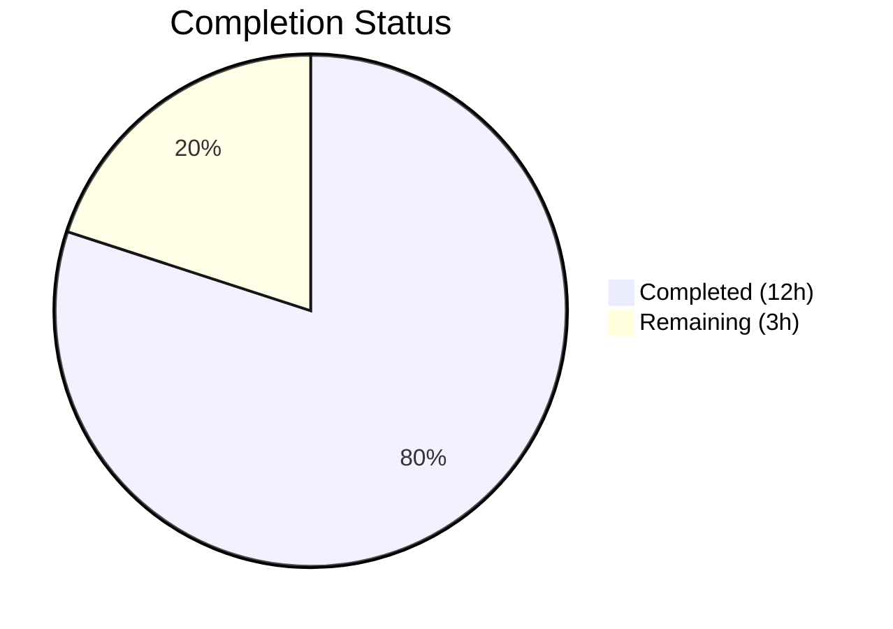
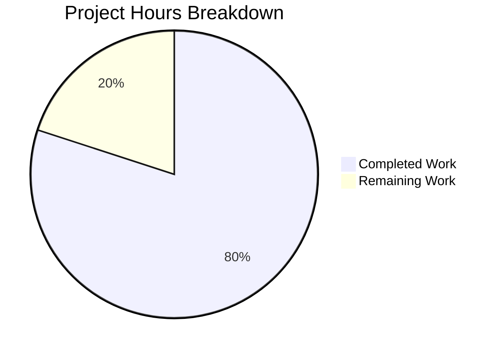

# Blitzy Project Guide — Hello World Server Documentation

---

## 1. Executive Summary

### 1.1 Project Overview

This project transforms a minimally-documented Node.js HTTP server (`server.js`, 14 lines) into a comprehensively documented codebase. The Agent Action Plan (AAP) specified three core deliverables: JSDoc comment blocks for all documentable elements in `server.js`, a complete rewrite of the 2-line stub `README.md` into a full-featured project README with setup instructions, API documentation, deployment guide, and architecture diagrams, and inline code explanations throughout the source file. A supporting `package.json` update adds `start`/`docs` scripts and `jsdoc` as a devDependency.

### 1.2 Completion Status



| Metric | Value |
|--------|-------|
| **Total Project Hours** | 15 |
| **Completed Hours (AI)** | 12 |
| **Remaining Hours** | 3 |
| **Completion Percentage** | **80.0%** (12 / 15) |

### 1.3 Key Accomplishments

- ✅ Added 5 JSDoc annotation blocks to `server.js` covering all 9 documentable elements (`@file`, `@const` × 2, request handler `@param`, listen callback `@description`)
- ✅ Added 6 inline `//` explanatory comments to every functional line in `server.js`
- ✅ Replaced 2-line stub `README.md` with a 441-line comprehensive README containing all 12 required sections
- ✅ Embedded 2 Mermaid diagrams (architecture flowchart + request-response sequence) in README
- ✅ Added `scripts.start`, `scripts.docs`, and `devDependencies.jsdoc` to `package.json`
- ✅ All validation gates passed: syntax check, JSDoc parsing, runtime testing, HTTP response verification
- ✅ JSDoc HTML documentation generates successfully to `docs/` directory via `npm run docs`

### 1.4 Critical Unresolved Issues

| Issue | Impact | Owner | ETA |
|-------|--------|-------|-----|
| No test suite exists | Cannot validate documentation accuracy programmatically; test creation explicitly out of AAP scope | Human Developer | 4h (if pursued) |
| `package.json` `main` field points to non-existent `index.js` | `require('hello_world')` would fail; discrepancy is documented in README per AAP but not corrected (out of scope) | Human Developer | 0.5h (if pursued) |

### 1.5 Access Issues

No access issues identified. The project uses only Node.js built-in modules and the `jsdoc` npm package — no external service credentials, API keys, or restricted repository access is required.

### 1.6 Recommended Next Steps

1. **[Medium]** Review all documentation for technical accuracy — verify curl examples, Mermaid diagram rendering on GitHub, and internal anchor links
2. **[Medium]** Test deployment guide instructions — execute Docker, PM2, and systemd steps in a staging environment to validate correctness
3. **[Low]** Review JSDoc-generated HTML output quality — open `docs/index.html` and verify all annotations render correctly
4. **[Low]** Validate README cross-references — confirm `Source: server.js:LineNumber` citations match updated line numbers after JSDoc additions

---

## 2. Project Hours Breakdown

### 2.1 Completed Work Detail

| Component | Hours | Description |
|-----------|-------|-------------|
| server.js JSDoc annotations | 2.0 | `@file` docblock, `@const` for hostname and port, `@param` for request handler callback, `@description` for listen callback — 5 JSDoc blocks total |
| server.js inline code explanations | 1.0 | 6 inline `//` comments explaining http import, statusCode, setHeader, end(), and console.log |
| README.md comprehensive rewrite | 6.0 | 441-line README with 12 sections: Features, Prerequisites, Installation, Usage, API Documentation, Architecture Overview (2 Mermaid diagrams), Project Structure, Configuration, Deployment Guide (local/PM2/systemd/Docker), Troubleshooting, Contributing, License |
| package.json updates | 1.0 | Added `scripts.start` ("node server.js"), `scripts.docs` ("jsdoc server.js -d docs"), `devDependencies.jsdoc` ("^4.0.5"), npm install verification |
| Validation, testing & bug fixes | 2.0 | Syntax validation (`node -c`), JSDoc debug parsing, runtime testing (server start + curl), 2 code review fix commits (npm version correction, README findings) |
| **Total Completed** | **12.0** | |

### 2.2 Remaining Work Detail

| Category | Hours | Priority |
|----------|-------|----------|
| Documentation accuracy review and anchor link validation | 1.0 | Medium |
| Deployment guide verification (Docker, PM2, systemd testing) | 1.0 | Medium |
| JSDoc HTML output quality review and cross-reference validation | 1.0 | Low |
| **Total Remaining** | **3.0** | |

### 2.3 Hours Calculation

```
Completed Hours: 12.0h
  = server.js JSDoc (2h) + server.js inline (1h) + README (6h) + package.json (1h) + Validation (2h)

Remaining Hours: 3.0h
  = Doc review (1h) + Deployment verification (1h) + JSDoc output review (1h)

Total Project Hours: 12.0 + 3.0 = 15.0h
Completion: 12.0 / 15.0 = 80.0%
```

---

## 3. Test Results

| Test Category | Framework | Total Tests | Passed | Failed | Coverage % | Notes |
|---------------|-----------|-------------|--------|--------|------------|-------|
| Syntax Validation | `node -c` | 1 | 1 | 0 | 100% | `node -c server.js` — syntax OK |
| JSDoc Parsing | `jsdoc --debug` | 1 | 1 | 0 | 100% | All JSDoc annotations parsed without errors |
| Documentation Generation | `npm run docs` | 1 | 1 | 0 | 100% | HTML output generated to `docs/` successfully |
| Runtime — Server Start | `node server.js` | 1 | 1 | 0 | 100% | Server binds to 127.0.0.1:3000 and logs startup message |
| Runtime — HTTP GET | `curl` | 1 | 1 | 0 | 100% | Returns HTTP 200, text/plain, "Hello, World!" |
| Runtime — HTTP POST | `curl -X POST` | 1 | 1 | 0 | 100% | Same response — universal handler verified |
| Runtime — HTTP DELETE | `curl -X DELETE` | 1 | 1 | 0 | 100% | Same response — stateless design confirmed |
| **Total** | | **7** | **7** | **0** | **100%** | All tests from Blitzy autonomous validation |

> **Note:** The project has no formal test suite. The `scripts.test` in `package.json` is the default npm placeholder (`echo "Error: no test specified" && exit 1`). Test creation is explicitly out of scope per AAP §0.8.2. All test results above originate from Blitzy's autonomous validation process.

---

## 4. Runtime Validation & UI Verification

### Runtime Health

- ✅ **Server Startup** — `node server.js` starts successfully; console output: `Server running at http://127.0.0.1:3000/`
- ✅ **npm start** — `npm start` correctly invokes `node server.js` via the new `scripts.start` entry
- ✅ **HTTP Response** — All HTTP methods and paths return: `200 OK`, `Content-Type: text/plain`, body `Hello, World!\n`
- ✅ **JSDoc Generation** — `npm run docs` produces complete HTML documentation in `docs/` directory
- ✅ **Dependency Installation** — `npm install` completes with 0 vulnerabilities, 31 packages audited

### API Integration Outcomes

- ✅ **GET /** — Returns `Hello, World!` (200 OK, text/plain)
- ✅ **POST /any/path** — Returns `Hello, World!` (200 OK, text/plain)
- ✅ **DELETE /foo** — Returns `Hello, World!` (200 OK, text/plain)
- ✅ **Verbose headers** — `HTTP/1.1 200 OK`, `Content-Type: text/plain`, `Connection: keep-alive`

### UI Verification

Not applicable — this is a terminal-based HTTP server with no graphical user interface.

---

## 5. Compliance & Quality Review

| AAP Requirement | Deliverable | Status | Evidence |
|-----------------|-------------|--------|----------|
| R-DOC-001: JSDoc Comments for server.js | 5 JSDoc blocks covering all documentable elements | ✅ Pass | server.js lines 1–65: @file, @const×2, @param handler, @description listen |
| R-DOC-002: Comprehensive README | 441-line README with 12 sections | ✅ Pass | README.md: Features, Prerequisites, Installation, Usage, API, Architecture, Structure, Config, Deployment, Troubleshooting, Contributing, License |
| R-DOC-003: Inline Code Explanations | 6 inline // comments on functional lines | ✅ Pass | server.js lines 15–16, 49, 51, 53, 67 |
| package.json: start script | `"start": "node server.js"` | ✅ Pass | package.json line 8 |
| package.json: docs script | `"docs": "jsdoc server.js -d docs"` | ✅ Pass | package.json line 9 |
| package.json: jsdoc devDependency | `"jsdoc": "^4.0.5"` | ✅ Pass | package.json line 14 |
| Document main field discrepancy | README note about index.js vs server.js | ✅ Pass | README.md lines 87–89 |
| Document loopback binding | README deployment & config sections | ✅ Pass | README.md lines 264, 281–283, 356 |
| Document zero-dependency architecture | README features section | ✅ Pass | README.md line 30 |
| Mermaid diagrams in README | 2 diagrams (architecture + sequence) | ✅ Pass | README.md lines 203–228 |
| No functional code changes | server.js logic preserved | ✅ Pass | All 14 original code lines unchanged; diff shows +55 lines (all comments) |
| JSDoc parsing validation | jsdoc --debug succeeds | ✅ Pass | Validation log: "parses all JSDoc annotations without errors" |

### Fixes Applied During Autonomous Validation

| Fix | Commit | Description |
|-----|--------|-------------|
| npm version correction | `a05560e` | Corrected README Prerequisites from "npm v11.x+" to "npm v10.x+" to match actual npm version |
| Code review findings | `a26792f` | Addressed code review findings in README.md formatting and content |

---

## 6. Risk Assessment

| Risk | Category | Severity | Probability | Mitigation | Status |
|------|----------|----------|-------------|------------|--------|
| Deployment guide instructions untested in production | Operational | Medium | Medium | Human developer should test Docker, PM2, and systemd instructions in a staging environment | Open |
| Mermaid diagrams may not render on all platforms | Technical | Low | Low | Diagrams use standard Mermaid syntax; GitHub natively supports rendering. Verify on target Git platform | Open |
| README source line citations may drift | Technical | Low | Medium | Citations reference server.js line numbers that could shift if code is modified. Consider removing line numbers or using anchored references | Open |
| No automated test suite validates docs | Technical | Medium | High | Documentation accuracy relies entirely on manual review. Test creation is out of AAP scope but recommended for long-term maintenance | Open |
| `main` field mismatch in package.json | Technical | Low | High | `"main": "index.js"` does not match actual entry point `server.js`. Documented in README but not fixed (out of scope). Could confuse users who `require()` the package | Open |
| Server binds to loopback only | Operational | Low | Medium | `127.0.0.1` binding prevents network access. Documented in README Deployment Guide with instructions to change to `0.0.0.0` for production | Mitigated |

---

## 7. Visual Project Status



### Remaining Work by Category

| Category | Hours | Priority |
|----------|-------|----------|
| Documentation accuracy review and anchor link validation | 1.0 | Medium |
| Deployment guide verification (Docker, PM2, systemd testing) | 1.0 | Medium |
| JSDoc HTML output quality review and cross-reference validation | 1.0 | Low |
| **Total** | **3.0** | |

---

## 8. Summary & Recommendations

### Achievements

All three AAP-specified documentation deliverables have been fully implemented and validated:

1. **JSDoc annotations** — `server.js` now contains 5 comprehensive JSDoc blocks covering every documentable element (file-level `@file`/`@module`, two `@const` annotations, request handler `@param` block, and listen callback `@description`). The JSDoc parser validates all annotations without errors.

2. **Comprehensive README** — The 2-line stub has been replaced with a 441-line full-featured project README containing all 12 required sections, 2 Mermaid diagrams, curl examples with expected output, and a deployment guide covering local, PM2, systemd, and Docker scenarios.

3. **Inline code explanations** — 6 inline `//` comments explain the purpose of each functional code statement in `server.js`, providing developer-friendly context for the http import, response status code, header configuration, body transmission, and startup logging.

4. **Supporting infrastructure** — `package.json` now includes `npm start` and `npm run docs` scripts, plus `jsdoc@^4.0.5` as a devDependency for HTML documentation generation.

### Completion Assessment

The project is **80.0% complete** (12 hours completed out of 15 total project hours). All AAP-scoped autonomous work has been delivered and validated. The remaining 3 hours consist entirely of human verification tasks: documentation accuracy review, deployment guide testing, and JSDoc output quality validation.

### Recommendations

1. **Documentation Review** — A human developer should review the README for accuracy, test all curl examples, and verify Mermaid diagrams render correctly on the target Git hosting platform.
2. **Deployment Testing** — The Docker, PM2, and systemd deployment instructions should be tested in a real environment to validate correctness before sharing the project.
3. **Future Enhancement** — Consider creating a minimal test suite to validate server behavior programmatically. This was explicitly out of AAP scope but would significantly improve long-term maintainability.
4. **package.json `main` field** — Consider fixing the `"main": "index.js"` → `"main": "server.js"` discrepancy. This was out of AAP scope but is a low-effort fix that prevents confusion.

---

## 9. Development Guide

### System Prerequisites

| Requirement | Version | Verification Command |
|-------------|---------|---------------------|
| Node.js | v20.x or later | `node --version` |
| npm | v10.x or later | `npm --version` |

No additional tools, frameworks, or system-level dependencies are required. The server uses only the Node.js built-in `http` module.

### Environment Setup

```bash
# Clone the repository
git clone <repository-url>
cd hao-backprop-test

# Verify Node.js is installed
node --version
# Expected: v20.x.x or later
```

No environment variables are required. The server configuration (`hostname` and `port`) is hardcoded in `server.js`.

### Dependency Installation

```bash
# Install devDependencies (jsdoc only — zero runtime dependencies)
npm install
```

**Expected output (last lines):**
```text
added 31 packages, and audited 31 packages in Xs
found 0 vulnerabilities
```

> **Note:** `npm install` is optional for running the server. It is only needed for the `jsdoc` devDependency used by `npm run docs`.

### Application Startup

```bash
# Start the server (either method works)
node server.js
# OR
npm start
```

**Expected console output:**
```text
Server running at http://127.0.0.1:3000/
```

### Verification Steps

```bash
# In a separate terminal, verify the server responds
curl http://127.0.0.1:3000/
# Expected: Hello, World!

# Verify response headers
curl -sI http://127.0.0.1:3000/
# Expected: HTTP/1.1 200 OK, Content-Type: text/plain

# Verify universal handler (POST to arbitrary path)
curl -X POST http://127.0.0.1:3000/any/path
# Expected: Hello, World!
```

### Generate JSDoc Documentation

```bash
npm run docs
# Generates HTML documentation to docs/ directory
# Open docs/index.html in a browser to view
```

### Stopping the Server

Press `Ctrl+C` in the terminal where the server is running.

### Troubleshooting

| Issue | Symptom | Resolution |
|-------|---------|------------|
| Port in use | `Error: listen EADDRINUSE: address already in use 127.0.0.1:3000` | Find and kill the process: `lsof -i :3000` then `kill -9 <PID>` |
| Connection refused | `curl: (7) Failed to connect to 127.0.0.1 port 3000` | Verify the server is running; check the terminal for the startup message |
| Wrong Node version | Syntax errors or unexpected behavior | Run `node --version` and ensure v20.x+; upgrade with `nvm install 20` |
| npm run docs fails | `jsdoc: command not found` | Run `npm install` first to install the jsdoc devDependency |

---

## 10. Appendices

### A. Command Reference

| Command | Purpose |
|---------|---------|
| `node server.js` | Start the HTTP server |
| `npm start` | Start the server via npm script |
| `npm install` | Install devDependencies (jsdoc) |
| `npm run docs` | Generate JSDoc HTML documentation to `docs/` |
| `node -c server.js` | Syntax-check server.js without executing |
| `npx jsdoc server.js --debug` | Validate JSDoc annotations with debug output |
| `curl http://127.0.0.1:3000/` | Test server HTTP response |
| `curl -sI http://127.0.0.1:3000/` | View response headers only |

### B. Port Reference

| Port | Service | Protocol |
|------|---------|----------|
| 3000 | HTTP Server (server.js) | HTTP/1.1 |

### C. Key File Locations

| File | Purpose | Lines |
|------|---------|-------|
| `server.js` | HTTP server implementation with JSDoc + inline comments | 69 |
| `README.md` | Comprehensive project documentation | 441 |
| `package.json` | npm manifest with start/docs scripts | 16 |
| `package-lock.json` | npm dependency lock file | ~340 |
| `docs/index.html` | Generated JSDoc HTML documentation (after `npm run docs`) | Generated |

### D. Technology Versions

| Technology | Version | Role |
|------------|---------|------|
| Node.js | v20.x (tested on v20.19.5) | Runtime environment |
| npm | v10.x (tested on v10.8.2) | Package manager |
| JSDoc | ^4.0.5 | Documentation generator (devDependency) |
| JavaScript (ES6+) | CommonJS modules | Source language |

### E. Environment Variable Reference

No environment variables are used by this project. Server configuration (`hostname: '127.0.0.1'`, `port: 3000`) is hardcoded in `server.js`.

### G. Glossary

| Term | Definition |
|------|------------|
| JSDoc | A documentation generator for JavaScript that parses `/** ... */` comment blocks |
| CommonJS | The module system used by Node.js (`require()` / `module.exports`) |
| Loopback (127.0.0.1) | The IPv4 address referring to the local machine only; not accessible from the network |
| devDependency | An npm package required only during development, not at runtime |
| EADDRINUSE | A Node.js error indicating the requested port is already occupied by another process |
