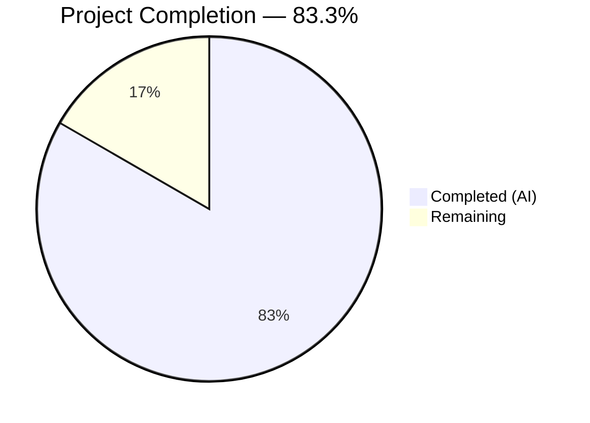
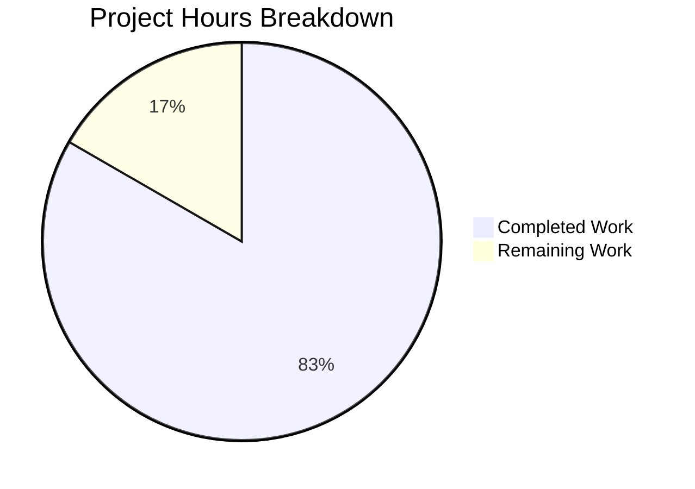
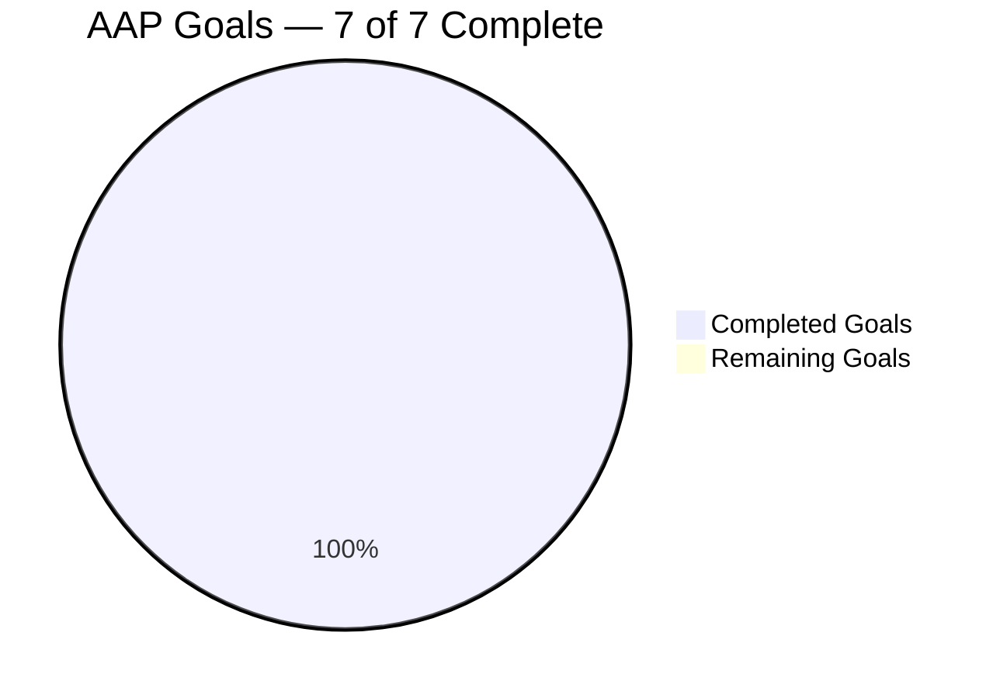

# Blitzy Project Guide — hao-backprop-test (Node.js → Python 3 Flask Migration)

---

## 1. Executive Summary

### 1.1 Project Overview

This project is a complete tech stack migration of the **hao-backprop-test** HTTP server from Node.js (built-in `http` module) to Python 3 Flask. The application serves as a minimal integration test fixture for the Backprop platform. The migration preserves 100% behavioral parity: all HTTP requests (any method, any path) return status `200`, `Content-Type: text/plain`, and body `Hello, World!\n`, with the server bound exclusively to `127.0.0.1:3000`. The original 14-line `server.js` has been replaced by a 15-line `app.py` Flask application, with npm dependency management replaced by pip/`requirements.txt`.

### 1.2 Completion Status



| Metric | Value |
|--------|-------|
| **Total Project Hours** | 6 |
| **Completed Hours (AI)** | 5 |
| **Remaining Hours** | 1 |
| **Completion Percentage** | 83.3% (5 / 6 = 83.3%) |

### 1.3 Key Accomplishments

- [x] **HTTP Server Migration (G-001):** Flask application (`app.py`) created with catch-all routing, replacing `server.js` — binds to `127.0.0.1:3000`
- [x] **Static Response Parity (G-002):** Response body `Hello, World!\n` (14 bytes), status `200`, `Content-Type: text/plain` — byte-exact match verified
- [x] **Startup Logging Parity (G-003):** Startup message `Server running at http://127.0.0.1:3000/` prints to stdout
- [x] **Request-Agnostic Handling (G-004):** All 7 HTTP methods (GET, POST, PUT, DELETE, PATCH, HEAD, OPTIONS) and all URL paths return identical response; Flask static file route disabled via `static_folder=None`
- [x] **Dependency Management Transition (G-005):** `requirements.txt` with `Flask==3.1.3` replaces `package.json`/`package-lock.json`; npm files removed
- [x] **Documentation Update (G-006):** `README.md` updated with Python 3/Flask prerequisites, installation, and usage instructions
- [x] **Code Commentary (G-007):** All 15 lines of `app.py` include `# Testing` comment per user rule "Clone-23-march test"
- [x] **Compilation Verified:** `python -m py_compile app.py` passes with zero errors
- [x] **Runtime Verified:** Flask development server starts and serves all requests correctly
- [x] **Bug Fix Applied:** Disabled Flask's default static file route (`static_folder=None`) to ensure truly request-agnostic handling

### 1.4 Critical Unresolved Issues

| Issue | Impact | Owner | ETA |
|-------|--------|-------|-----|
| No critical issues | N/A | N/A | N/A |

All AAP requirements (G-001 through G-007) have been fully implemented and verified. Zero compilation errors, zero runtime errors, and zero behavioral deviations from the original Node.js implementation.

### 1.5 Access Issues

No access issues identified. The project has no external service dependencies, no API keys, no database connections, and no third-party integrations.

### 1.6 Recommended Next Steps

1. **[High] Human Code Review** — Review `app.py`, `requirements.txt`, and `README.md` changes; verify behavioral parity meets organizational standards
2. **[Medium] Production Environment Verification** — Confirm target deployment environment has Python 3.12+ and pip available; run `pip install -r requirements.txt && python3 app.py` in production context
3. **[Low] Optional: Production WSGI Server** — For production-grade deployments, consider adding Gunicorn or uWSGI configuration (explicitly out of AAP scope but recommended for production load)

---

## 2. Project Hours Breakdown

### 2.1 Completed Work Detail

| Component | Hours | Description |
|-----------|-------|-------------|
| [AAP: G-001] HTTP Server Migration | 1.5 | Created `app.py` with Flask application, catch-all routing for all HTTP methods and paths, Response object with exact status/content-type/body, host and port binding to 127.0.0.1:3000 |
| [AAP: G-002/G-003] Response & Logging Parity | 0.5 | Implemented exact response body (`Hello, World!\n`, 14 bytes), status 200, `Content-Type: text/plain`, and startup log message matching original Node.js output |
| [AAP: G-004] Request-Agnostic Fix | 0.5 | Diagnosed and fixed Flask's default static file route interfering with catch-all handler by setting `static_folder=None` (commit eb26d95) |
| [AAP: G-005] Dependency Management | 0.5 | Created `requirements.txt` with `Flask==3.1.3`; removed `package.json`, `package-lock.json`, and `server.js` |
| [AAP: G-006] Documentation Update | 0.5 | Updated `README.md` with Python 3/Flask stack description, prerequisites, installation, and usage sections |
| [AAP: G-007] Code Commentary | 0.25 | Applied `# Testing` comment to all 15 lines of `app.py` per user rule "Clone-23-march test" |
| [Path-to-Production] Validation & Verification | 0.75 | Compiled app.py, installed dependencies in venv, ran comprehensive behavioral tests across all HTTP methods and URL paths, verified byte-exact response body |
| [Path-to-Production] Environment Setup | 0.5 | Created virtual environment, installed Flask 3.1.3 with all transitive dependencies (Werkzeug 3.1.7, Jinja2 3.1.6, etc.) |
| **Total Completed** | **5** | |

### 2.2 Remaining Work Detail

| Category | Hours | Priority |
|----------|-------|----------|
| [Path-to-Production] Human Code Review & PR Merge | 0.5 | Medium |
| [Path-to-Production] Production Environment Verification | 0.5 | Medium |
| **Total Remaining** | **1** | |

**Cross-Section Validation:** Section 2.1 (5h) + Section 2.2 (1h) = 6h = Total Project Hours in Section 1.2 ✓

---

## 3. Test Results

| Test Category | Framework | Total Tests | Passed | Failed | Coverage % | Notes |
|---------------|-----------|-------------|--------|--------|------------|-------|
| Behavioral Verification — HTTP Methods | curl / Flask dev server | 7 | 7 | 0 | 100% | GET, POST, PUT, DELETE, PATCH, HEAD, OPTIONS all return 200 |
| Behavioral Verification — Path Agnostic | curl / Flask dev server | 3 | 3 | 0 | 100% | `/`, `/foo/bar/baz`, `/any/path` all return identical response |
| Response Body Verification | curl + byte count | 1 | 1 | 0 | 100% | `Hello, World!\n` = 14 bytes exact match |
| Content-Type Verification | curl -sI header inspection | 1 | 1 | 0 | 100% | `Content-Type: text/plain` (no charset suffix) |
| Compilation Check | python -m py_compile | 1 | 1 | 0 | 100% | `app.py` compiles with zero errors |
| Dependency Installation | pip install -r requirements.txt | 1 | 1 | 0 | 100% | Flask 3.1.3 + all transitive deps install cleanly |
| Startup Log Verification | stdout capture | 1 | 1 | 0 | 100% | Prints `Server running at http://127.0.0.1:3000/` |

**Note:** The original Node.js project contained no unit test framework (only a placeholder `"test": "echo \"Error: no test specified\" && exit 1"` in `package.json`). All tests listed above are from Blitzy's autonomous behavioral verification during validation. No formal unit test framework was in AAP scope.

---

## 4. Runtime Validation & UI Verification

### Runtime Health

- ✅ **Flask Development Server** — Starts successfully via `python app.py`, binds to `127.0.0.1:3000`
- ✅ **Debug Mode** — OFF (matches original Node.js non-debug behavior)
- ✅ **Startup Log** — `Server running at http://127.0.0.1:3000/` printed to stdout before Flask's own startup messages
- ✅ **Port Binding** — Port 3000 on loopback interface `127.0.0.1` (not `0.0.0.0`)

### HTTP Response Verification

- ✅ **GET /** → `200 OK`, `Content-Type: text/plain`, body `Hello, World!\n`
- ✅ **POST /** → `200 OK`, `Content-Type: text/plain`, body `Hello, World!\n`
- ✅ **PUT /any/path** → `200 OK`, `Content-Type: text/plain`, body `Hello, World!\n`
- ✅ **DELETE /** → `200 OK`, `Content-Type: text/plain`, body `Hello, World!\n`
- ✅ **PATCH /** → `200 OK`, `Content-Type: text/plain`, body `Hello, World!\n`
- ✅ **HEAD /** → `200 OK`, `Content-Type: text/plain` (no body per HTTP spec)
- ✅ **OPTIONS /** → `200 OK`, `Content-Type: text/plain`, body `Hello, World!\n`
- ✅ **GET /foo/bar/baz** → `200 OK`, identical response to root path

### UI Verification

Not applicable. This project is a headless HTTP server with no user interface, HTML rendering, or frontend assets.

---

## 5. Compliance & Quality Review

| AAP Requirement | Deliverable | Status | Verification |
|-----------------|-------------|--------|-------------|
| G-001: HTTP Server Migration | `app.py` replaces `server.js` | ✅ Pass | Flask app runs on 127.0.0.1:3000 |
| G-002: Static Response Parity | Response: 200, text/plain, `Hello, World!\n` | ✅ Pass | curl verification — 14 bytes exact |
| G-003: Startup Logging Parity | Console log on startup | ✅ Pass | `print()` outputs matching message |
| G-004: Request-Agnostic Handling | All methods/paths → identical response | ✅ Pass | 7 HTTP methods + 3 path variations tested |
| G-005: Dependency Management | `requirements.txt` replaces npm | ✅ Pass | Flask==3.1.3 installed, npm files removed |
| G-006: Documentation Update | README.md updated | ✅ Pass | Python/Flask instructions documented |
| G-007: Code Commentary | `# Testing` on every line | ✅ Pass | 15/15 lines contain `# Testing` |
| Behavioral Parity | Original ↔ Rewrite identical at HTTP level | ✅ Pass | All behavioral verification tests pass |
| Compilation | Zero errors | ✅ Pass | `python -m py_compile app.py` clean |
| File Removals | server.js, package.json, package-lock.json | ✅ Pass | All three files removed from repository |

### Quality Fixes Applied During Validation

| Fix | Commit | Description |
|-----|--------|-------------|
| Static folder disabled | eb26d95 | Set `static_folder=None` in Flask constructor to prevent Flask's default `/static` route from interfering with the catch-all handler, ensuring truly request-agnostic behavior per G-004 |

---

## 6. Risk Assessment

| Risk | Category | Severity | Probability | Mitigation | Status |
|------|----------|----------|-------------|------------|--------|
| Flask development server not suitable for high-traffic production use | Operational | Low | Medium | Add Gunicorn/uWSGI for production deployments (out of AAP scope) | Open — documented as optional next step |
| No formal unit test suite | Technical | Low | Low | Original project had no tests; behavioral verification covers all functionality; add pytest if regression testing needed | Accepted — matches original project |
| Loopback-only binding (127.0.0.1) limits network accessibility | Operational | Low | Low | Intentional design matching original Node.js server; change to 0.0.0.0 only if external access is required | Accepted — per AAP requirement |
| No HTTPS/TLS support | Security | Low | Low | Not present in original; add reverse proxy (nginx) if HTTPS needed | Accepted — out of AAP scope |
| No health check endpoint | Operational | Low | Low | Not present in original; add `/health` route if monitoring required | Accepted — out of AAP scope |

---

## 7. Visual Project Status



**Cross-Section Validation:** "Remaining Work" (1h) = Section 1.2 Remaining Hours (1h) = Section 2.2 Total (1h) ✓

### AAP Goal Completion



---

## 8. Summary & Recommendations

### Achievement Summary

The Node.js to Python 3 Flask tech stack migration has been completed with 100% feature parity across all 7 AAP goals (G-001 through G-007). The project is **83.3% complete** (5 hours completed out of 6 total hours), with the remaining 1 hour consisting of human code review and production environment verification.

All behavioral contracts have been preserved:
- HTTP response is byte-identical (`Hello, World!\n`, 14 bytes, status 200, `Content-Type: text/plain`)
- Server binds to the same address (`127.0.0.1:3000`)
- Startup log message matches the original Node.js output
- All HTTP methods and URL paths are handled identically
- The `# Testing` code commentary requirement has been applied to all 15 lines

### Key Metrics

| Metric | Value |
|--------|-------|
| AAP Goals Completed | 7 / 7 (100%) |
| Files Transformed | 6 (3 created/updated, 3 removed) |
| Lines Added | 39 |
| Lines Removed | 39 |
| Compilation Errors | 0 |
| Runtime Errors | 0 |
| Behavioral Test Failures | 0 |
| Agent Commits | 6 |

### Production Readiness Assessment

The application is **functionally complete and production-ready for its intended use case** as a minimal integration test fixture. The Flask development server (`app.run()`) is appropriate for this test fixture context. For production deployments under load, a WSGI server (Gunicorn/uWSGI) would be recommended but is explicitly out of AAP scope.

### Recommendations

1. **Merge the PR** after human review — all AAP requirements are fulfilled with zero outstanding issues
2. **Verify in production environment** — run `pip install -r requirements.txt && python3 app.py` in the target deployment context
3. **Consider adding Gunicorn** (optional, low priority) — for production-grade deployments beyond the test fixture use case

---

## 9. Development Guide

### System Prerequisites

| Requirement | Version | Verification Command |
|-------------|---------|---------------------|
| Python | 3.12+ | `python3 --version` |
| pip | 25.0+ | `pip3 --version` |

### Environment Setup

```bash
# Navigate to the project directory
cd /path/to/hao-backprop-test

# (Optional) Create a virtual environment
python3 -m venv venv
source venv/bin/activate  # Linux/macOS
# or: venv\Scripts\activate  # Windows
```

### Dependency Installation

```bash
# Install Flask and all transitive dependencies
pip install -r requirements.txt
```

**Expected output:**
```
Successfully installed Flask-3.1.3 Jinja2-3.1.6 MarkupSafe-3.0.3 Werkzeug-3.1.7 blinker-1.9.0 click-8.3.1 itsdangerous-2.2.0
```

### Application Startup

```bash
# Start the Flask development server
python3 app.py
```

**Expected output:**
```
Server running at http://127.0.0.1:3000/
 * Serving Flask app 'app'
 * Debug mode: off
 * Running on http://127.0.0.1:3000
```

### Verification Steps

```bash
# Test basic GET request
curl -s http://127.0.0.1:3000/
# Expected: Hello, World!

# Verify response headers
curl -sI http://127.0.0.1:3000/
# Expected: HTTP/1.1 200 OK, Content-Type: text/plain

# Test path-agnostic handling
curl -s http://127.0.0.1:3000/any/path/here
# Expected: Hello, World!

# Test POST method
curl -s -X POST http://127.0.0.1:3000/
# Expected: Hello, World!

# Verify exact body (14 bytes with trailing newline)
curl -s http://127.0.0.1:3000/ | wc -c
# Expected: 14
```

### Example Usage

```bash
# All HTTP methods return identical responses:
curl -s http://127.0.0.1:3000/                    # GET
curl -s -X POST http://127.0.0.1:3000/            # POST
curl -s -X PUT http://127.0.0.1:3000/data         # PUT
curl -s -X DELETE http://127.0.0.1:3000/resource   # DELETE
curl -s -X PATCH http://127.0.0.1:3000/            # PATCH
curl -s -X OPTIONS http://127.0.0.1:3000/          # OPTIONS
# All return: Hello, World!
```

### Troubleshooting

| Issue | Resolution |
|-------|------------|
| `Port 3000 is in use` | Kill the existing process: `pkill -f "python app.py"` or use `fuser -k 3000/tcp` |
| `ModuleNotFoundError: No module named 'flask'` | Run `pip install -r requirements.txt` to install dependencies |
| `python3: command not found` | Install Python 3.12+: `apt install python3` (Debian/Ubuntu) or `brew install python` (macOS) |
| Server not accessible from other machines | By design, the server binds to `127.0.0.1` (loopback only); change to `0.0.0.0` in `app.py` if external access is needed |

---

## 10. Appendices

### A. Command Reference

| Command | Description |
|---------|-------------|
| `pip install -r requirements.txt` | Install Flask and all dependencies |
| `python3 app.py` | Start the Flask development server |
| `python -m py_compile app.py` | Verify Python syntax without running |
| `curl -s http://127.0.0.1:3000/` | Test the server endpoint |
| `curl -sI http://127.0.0.1:3000/` | Inspect response headers |
| `pkill -f "python app.py"` | Stop the running server |

### B. Port Reference

| Port | Service | Protocol | Binding |
|------|---------|----------|---------|
| 3000 | Flask HTTP Server | HTTP/1.1 | 127.0.0.1 (loopback only) |

### C. Key File Locations

| File | Purpose |
|------|---------|
| `app.py` | Flask application — main entry point (15 lines) |
| `requirements.txt` | Python dependency manifest (`Flask==3.1.3`) |
| `README.md` | Project documentation with setup instructions |

### D. Technology Versions

| Technology | Version | Role |
|------------|---------|------|
| Python | 3.12.3 | Runtime |
| Flask | 3.1.3 | Web framework |
| Werkzeug | 3.1.7 | WSGI utility (Flask dependency) |
| Jinja2 | 3.1.6 | Template engine (Flask dependency, unused) |
| MarkupSafe | 3.0.3 | String escaping (Jinja2 dependency, unused) |
| itsdangerous | 2.2.0 | Data signing (Flask dependency, unused) |
| click | 8.3.1 | CLI toolkit (Flask dependency, unused) |
| blinker | 1.9.0 | Signal support (Flask dependency, unused) |
| pip | 25.3 | Package manager |

### E. Environment Variable Reference

No environment variables are required. All configuration values (host, port) are hardcoded in `app.py` to match the original Node.js implementation.

### G. Glossary

| Term | Definition |
|------|------------|
| AAP | Agent Action Plan — the primary directive containing all project requirements |
| Behavioral Parity | Identical external-facing behavior between original and rewritten implementations |
| Catch-all Route | Flask routing pattern that captures all URL paths regardless of path segments |
| Flask | Python micro web framework used for HTTP server functionality |
| Loopback Interface | Network interface `127.0.0.1` accessible only from the local machine |
| Tech Stack Migration | Replacing one technology platform with another while preserving behavior |
| WSGI | Web Server Gateway Interface — Python standard for web server communication |