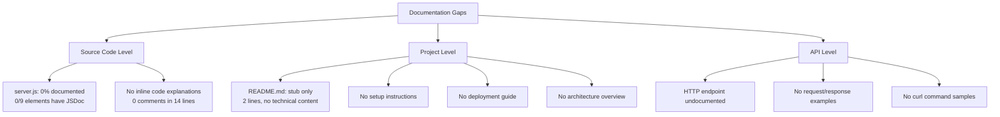

# Technical Specification

# 0. Agent Action Plan

## 0.1 Intent Clarification


### 0.1.1 Core Documentation Objective

Based on the provided requirements, the Blitzy platform understands that the documentation objective is to **transform a minimally-documented Node.js HTTP server project into a comprehensively documented codebase** by adding JSDoc comments to all functions and constructs in `server.js`, replacing the existing stub `README.md` with a full-featured project README, and embedding inline code explanations throughout the source file.

**Request Category:** Create new documentation | Update existing documentation

**Documentation Types:**
- **JSDoc inline comments** — Code-level API documentation for `server.js` functions, constants, and the request handler callback
- **Comprehensive README** — Project-level documentation encompassing setup instructions, API documentation, deployment guide, and architectural overview
- **Inline code explanations** — Descriptive comments within `server.js` that explain the purpose and behavior of each code block

**Requirement Breakdown with Enhanced Clarity:**

- **R-DOC-001: JSDoc Comments for `server.js`** — Add standards-compliant JSDoc comment blocks (`/** ... */`) to every documentable element in `server.js`, including:
  - The `http` module import and its purpose
  - The `hostname` and `port` constants with `@const` and `@type` annotations
  - The `http.createServer()` request handler callback with `@param` for `req`/`res` and `@description` of its behavior
  - The `server.listen()` startup callback with `@description` of the logging behavior
  - A file-level `@module` or `@file` docblock describing the overall purpose of the server

- **R-DOC-002: Comprehensive README** — Replace the current two-line `README.md` with a fully structured project README containing:
  - Project title, description, and badges
  - Table of contents for navigation
  - Prerequisites and system requirements
  - Step-by-step setup/installation instructions
  - Usage instructions with example commands and expected output
  - API documentation (HTTP endpoint specification with request/response details)
  - Deployment guide covering local, production, and containerized deployment
  - Project structure overview
  - Contributing guidelines
  - License information

- **R-DOC-003: Inline Code Explanations** — Embed descriptive inline comments (`//`) within `server.js` that explain the reasoning behind each code decision, the behavior of Node.js built-in APIs used, and the overall execution flow

**Implicit Documentation Needs Surfaced:**
- The `package.json` manifest declares `main: "index.js"` while the actual entry point is `server.js` — this discrepancy should be documented in the README to prevent confusion
- The server binds exclusively to `127.0.0.1` (loopback), which has implications for network accessibility that must be documented in the deployment guide
- Zero-dependency architecture is a deliberate design choice that should be explicitly documented as a feature
- The project has no `start` script in `package.json`, so the README must document the correct startup command (`node server.js`)

### 0.1.2 Special Instructions and Constraints

**User-Specified Directives:**
- Rule `23-march-rules-Document-code`: "Add JSDoc comments to server.js functions, create a comprehensive README with setup instructions, API documentation, deployment guide, and inline code explanations."
- Rule `QA-27-march-rules`: "npm" — indicating npm as the package manager for all documentation tooling

**Template Requirements:** No specific templates were provided by the user. Documentation will follow established Node.js community conventions and JSDoc standards.

**Style Preferences:**
- JSDoc comments must use the standard `/** ... */` block comment format compatible with the JSDoc parser
- README must use GitHub Flavored Markdown (GFM) for rendering on GitHub and npm
- Inline comments must use `//` single-line format for code explanations
- All documentation must be technically accurate and reflect the actual codebase behavior

**Web Search Requirements Addressed:**
- JSDoc best practices for Node.js CommonJS modules researched via jsdoc.app and community resources
- README structure conventions for Node.js projects validated against npm documentation guidelines and community standards

### 0.1.3 Technical Interpretation

These documentation requirements translate to the following technical documentation strategy:

- To **document the server module**, we will **update** `server.js` by adding a `@file` docblock at the top describing the module, `@const` annotations for `hostname` and `port`, a `@callback` or inline `@param`/`@returns` block for the `createServer` handler, and a descriptive block for the `server.listen` callback
- To **create the comprehensive README**, we will **replace** `README.md` with a structured Markdown document containing all required sections (setup, API docs, deployment guide) organized with a navigable table of contents
- To **add inline code explanations**, we will **update** `server.js` by inserting `//` comments above or beside each significant code statement explaining its purpose and behavior within the Node.js runtime

### 0.1.4 Inferred Documentation Needs

- Based on code analysis: `server.js` contains a `createServer` callback with `req` and `res` parameters and a `listen` callback — both require JSDoc parameter documentation despite being anonymous functions
- Based on structure: The entire application is a single file (`server.js`, 14 lines), so documentation must consolidate all API, architecture, and usage information into the README rather than splitting across multiple documentation files
- Based on dependencies: The project uses only Node.js built-in `http` module — documentation must clarify that no `npm install` step is required for runtime, only for optional development tooling (JSDoc generation)
- Based on user journey: A developer encountering this project needs a clear path from "clone the repo" → "understand the code" → "run the server" → "verify it works" → "deploy it" — the README must guide this complete workflow


## 0.2 Documentation Discovery and Analysis


### 0.2.1 Existing Documentation Infrastructure Assessment

A comprehensive repository search was conducted to discover all existing documentation artifacts, documentation generators, and related configuration files.

**Search Patterns Employed:**
- Documentation files: `README*`, `*.md`, `*.mdx`, `*.rst`, `docs/**`, `wiki/**`
- Documentation generators: `mkdocs.yml`, `docusaurus.config.js`, `sphinx.conf.py`, `jsdoc.json`, `jsdoc.conf.js`, `.jsdoc.json`
- Style guides and templates: `CONTRIBUTING.md`, `CHANGELOG.md`, `CODE_OF_CONDUCT.md`, `.editorconfig`
- Configuration: `.eslintrc*`, `tsconfig.json`, `.prettierrc*`

**Repository Analysis Findings:**

Repository analysis reveals a **minimal documentation structure** with a single stub README and **zero documentation infrastructure**. The project contains exactly four files at the root level with no subdirectories:

| File | Documentation Role | Status |
|------|-------------------|--------|
| `README.md` | Project documentation | Stub only — contains project name (`hao-backprop-test`) and a directive ("test project for backprop integration. Do not touch!") with no installation, usage, API, or architecture content |
| `server.js` | Source code | **Zero JSDoc comments**, zero inline explanations — 14 lines of bare implementation with no documentation annotations |
| `package.json` | Package metadata | Contains basic fields (`name`, `version`, `description`, `author`, `license`) but no `engines` field, no `start` script, and a mismatched `main` pointing to non-existent `index.js` |
| `package-lock.json` | Dependency lock | Confirms zero external dependencies — lockfileVersion 3, root package entry only |

**Documentation Infrastructure Status:**
- Current documentation framework: **None** — no documentation generator is configured
- Documentation generator configuration: **Not present** — no `jsdoc.json`, `mkdocs.yml`, `docusaurus.config.js`, or equivalent
- API documentation tools in use: **None** — no JSDoc, Swagger, or OpenAPI tooling installed
- Diagram tools detected: **None** — no Mermaid CLI, PlantUML, or equivalent configured
- Documentation hosting/deployment setup: **None** — no GitHub Pages, ReadTheDocs, or equivalent

### 0.2.2 Repository Code Analysis for Documentation

**Source Code Elements Requiring Documentation:**

Analysis of `server.js` (the sole source file) identified the following documentable elements:

| Element | Location | Type | Current Documentation |
|---------|----------|------|----------------------|
| `http` module import | Line 1 | CommonJS require | None |
| `hostname` constant | Line 3 | String constant (`'127.0.0.1'`) | None |
| `port` constant | Line 4 | Number constant (`3000`) | None |
| `server` creation with request handler | Lines 6–10 | `http.createServer()` callback | None |
| `res.statusCode` assignment | Line 7 | HTTP status code setter | None |
| `res.setHeader()` call | Line 8 | HTTP header configuration | None |
| `res.end()` call | Line 9 | Response body and stream termination | None |
| `server.listen()` with startup callback | Lines 12–14 | Server binding and log callback | None |
| `console.log()` template literal | Line 13 | Startup confirmation message | None |

**Key Directories Examined:**
- Repository root (`/`) — all 4 files inspected
- No subdirectories exist (`docs/`, `src/`, `lib/`, `test/`, `examples/` — all absent)

**Related Documentation Found:** None. The `README.md` contains no technical content beyond the project name and "Do not touch!" directive.

### 0.2.3 Web Search Research Conducted

The following research was conducted to inform documentation strategy:

- **JSDoc best practices for Node.js CommonJS modules**: The official JSDoc documentation at jsdoc.app provides guidance on annotating CommonJS modules with `@module`, `@const`, `@param`, `@returns`, and `@callback` tags. JSDoc version 4.0.5 is the latest stable release and supports Node.js 12.0.0 and later.

- **README structure conventions for Node.js projects**: npm's official documentation recommends that README files include installation, configuration, and usage instructions. Community best practices emphasize a table of contents, prerequisites, step-by-step setup, usage examples with expected output, API documentation, and license information.

- **Inline code documentation standards**: JSDoc supports Markdown within comments for richer formatting, and editors such as VS Code and JetBrains IDEs display JSDoc annotations in hover tooltips for improved developer experience.


## 0.3 Documentation Scope Analysis


### 0.3.1 Code-to-Documentation Mapping

**Module: `server.js` (Application Server — sole source file)**

- Public/documentable elements:
  - `hostname` — String constant defining the server bind address (`'127.0.0.1'`)
  - `port` — Number constant defining the listening port (`3000`)
  - `server` — The `http.Server` instance created by `http.createServer()`
  - Request handler callback `(req, res) => { ... }` — Anonymous function handling all HTTP requests
  - Listen callback `() => { ... }` — Anonymous function logging the server URL on successful bind
- Current documentation: **Missing** — zero JSDoc blocks, zero inline comments
- Documentation needed:
  - `@file` docblock at top of file describing the module purpose
  - `@const` annotations for `hostname` and `port` with `@type` tags
  - `@param` / `@description` for the `createServer` request handler
  - `@description` for the `listen` startup callback
  - Inline `//` comments explaining each code statement

**Configuration: `package.json` (Package Manifest)**

- Configuration options present: `name`, `version`, `description`, `main`, `scripts.test`, `author`, `license`
- Documentation status: Not directly documented; metadata is self-describing but the `main: "index.js"` discrepancy with actual entry point `server.js` needs explicit documentation in the README
- Documentation needed: README must reference `package.json` fields and call out the entry-point mismatch

**HTTP API Endpoint (Single Endpoint)**

- Endpoint: `GET|POST|PUT|DELETE|*` at any path on `http://127.0.0.1:3000/`
- Response: HTTP 200, `Content-Type: text/plain`, body `Hello, World!\n`
- Current documentation: **Missing** — no API specification exists
- Documentation needed: Full API specification in README with request/response examples, curl commands, and expected output

### 0.3.2 Documentation Gap Analysis

Given the requirements and repository analysis, documentation gaps include:

**Undocumented Code Elements (Complete List):**
- `server.js` — Every line of code lacks documentation annotations
  - No file-level docblock (`@file` or `@module`)
  - No constant annotations (`@const`, `@type`)
  - No function/callback documentation (`@param`, `@returns`, `@description`)
  - No inline explanatory comments

**Missing User-Facing Documentation:**
- No setup/installation guide — users have no instructions for cloning, installing, or running the project
- No API reference — the HTTP endpoint behavior is undocumented
- No deployment guide — no instructions for running in production, containerization, or process management
- No project architecture overview — the zero-dependency, single-file design is not explained
- No prerequisites documentation — Node.js version requirements are not stated
- No troubleshooting section — common issues (e.g., port 3000 already in use) are not addressed

**Missing Developer Documentation:**
- No contributing guidelines
- No code style documentation
- No development workflow instructions

**Outdated/Incomplete Documentation:**
- `README.md` — Contains only the project name and a "Do not touch!" directive; does not reflect the actual project capabilities, setup process, or API behavior




## 0.4 Documentation Implementation Design


### 0.4.1 Documentation Structure Planning

Given the project's minimal footprint (4 files, no subdirectories), documentation will be consolidated into two primary artifacts rather than a multi-file `docs/` hierarchy. This aligns with the project's simplicity and avoids over-engineering the documentation structure.

**Planned Documentation Hierarchy:**

```
/  (repository root)
├── README.md                  (comprehensive project documentation — UPDATE)
│   ├── Title and Description
│   ├── Table of Contents
│   ├── Features
│   ├── Prerequisites
│   ├── Installation / Setup
│   ├── Usage
│   ├── API Documentation
│   ├── Project Structure
│   ├── Deployment Guide
│   ├── Configuration
│   ├── Troubleshooting
│   ├── Contributing
│   └── License
├── server.js                  (JSDoc + inline comments — UPDATE)
│   ├── @file docblock
│   ├── @const annotations
│   ├── Request handler JSDoc
│   ├── Listen callback JSDoc
│   └── Inline // explanations
└── package.json               (add start script + docs script — UPDATE)
    ├── scripts.start
    └── scripts.docs
```

### 0.4.2 Content Generation Strategy

**Information Extraction Approach:**
- Extract API behavior from `server.js` lines 6–10 by analyzing the `createServer` callback's status code, header, and body assignments
- Generate usage examples by constructing curl commands targeting `http://127.0.0.1:3000/` and documenting the expected `Hello, World!\n` response
- Create the deployment guide by documenting the `node server.js` startup command, process manager options (PM2, systemd), and containerization with Docker
- Derive project structure documentation from the actual file listing at the repository root

**Documentation Standards:**
- Markdown formatting with proper heading hierarchy (`#` through `####`)
- Code examples using fenced code blocks with language identifiers (` ```bash `, ` ```javascript `, ` ```json `)
- Tables for structured data (API responses, project structure, configuration)
- Source citations as inline references: `Source: server.js:Line`
- Consistent terminology: "server" (not "app"), "request handler" (not "route"), "response" (not "reply")

**JSDoc Annotation Standards:**
- All JSDoc blocks use `/** ... */` format
- `@file` tag for the module-level docblock
- `@const {type}` for constants with `@default` values
- `@param {type} name - description` for function parameters
- `@returns {void}` where applicable
- `@description` for behavioral explanations
- `@see` for cross-references to related elements
- `@author` to preserve original authorship

### 0.4.3 Diagram and Visual Strategy

**Mermaid Diagrams to Include in README:**

- **Architecture Overview Diagram** — A simple flowchart showing the client → HTTP server → response flow, illustrating the stateless request-response cycle
- **Request-Response Sequence Diagram** — A sequence diagram showing the interaction between an HTTP client, the Node.js `http` module, and the response object
- **Server Lifecycle Diagram** — A state diagram showing the server startup, listening, and shutdown states

These diagrams will be embedded directly in the README using ` ```mermaid ` blocks, which are natively supported by GitHub's Markdown renderer without requiring external tooling.

No screenshots are required as this is a terminal-based server application with no UI.


## 0.5 Documentation File Transformation Mapping


### 0.5.1 File-by-File Documentation Plan

The following table maps every documentation file to be created, updated, or used as a reference. The target documentation file is listed first per specification requirements.

| Target Documentation File | Transformation | Source Code/Docs | Content/Changes |
|---------------------------|----------------|------------------|-----------------|
| `README.md` | **UPDATE** | `README.md`, `server.js`, `package.json` | Replace 2-line stub with comprehensive README containing: project title/description, table of contents, features list, prerequisites (Node.js v20.x), installation steps, usage instructions with curl examples, full API endpoint documentation (HTTP 200, text/plain, `Hello, World!\n`), project structure table, deployment guide (local, PM2, Docker), configuration notes, troubleshooting section, contributing guidelines, and MIT license reference. Include Mermaid architecture and sequence diagrams. |
| `server.js` | **UPDATE** | `server.js` | Add JSDoc annotations and inline code explanations: (1) `@file` docblock at line 1 describing the module as a minimal HTTP server, (2) `@const {string}` for `hostname` with `@default '127.0.0.1'`, (3) `@const {number}` for `port` with `@default 3000`, (4) JSDoc block for the `createServer` request handler callback with `@param {http.IncomingMessage} req` and `@param {http.ServerResponse} res`, (5) JSDoc block for the `listen` callback describing the startup log, (6) inline `//` comments on each functional line explaining purpose and behavior. |
| `package.json` | **UPDATE** | `package.json` | Add `"start": "node server.js"` to `scripts` for conventional startup command, add `"docs": "jsdoc server.js -d docs"` to `scripts` for JSDoc HTML generation, add `jsdoc` to `devDependencies` for documentation generation tooling. |

### 0.5.2 New Documentation Content Detail

No entirely new documentation files are created — all documentation is consolidated into the existing `README.md` and `server.js` files, which is appropriate for this single-file project. The `README.md` update is effectively a complete rewrite.

**File: `README.md` (Complete Rewrite)**
- Type: Comprehensive Project README
- Source Code: `server.js` (lines 1–14), `package.json` (all fields)
- Sections:
  - **Project Title and Description** — Name, one-line description, badges
  - **Table of Contents** — Linked navigation to all sections
  - **Features** — Zero-dependency HTTP server, single-command startup, stateless design
  - **Prerequisites** — Node.js v20.x or later required
  - **Installation** — Clone, verify Node.js, run the server
  - **Usage** — `node server.js` command, curl examples, expected output
  - **API Documentation** — Endpoint specification table, request/response format, curl examples
  - **Project Structure** — File-by-file description table
  - **Deployment Guide** — Local development, production with PM2/systemd, Docker containerization
  - **Configuration** — `hostname` and `port` constants (hardcoded in `server.js`)
  - **Troubleshooting** — Port conflicts (EADDRINUSE), Node.js version issues
  - **Contributing** — Fork, branch, commit, PR workflow
  - **License** — MIT (from `package.json`)
- Diagrams:
  - Architecture overview flowchart (client → server → response)
  - Request-response sequence diagram
- Key Citations: `server.js:1-14`, `package.json:1-11`

**File: `server.js` (JSDoc + Inline Comments Augmentation)**
- Type: Source code with JSDoc annotations and inline explanations
- Source Code: `server.js` (existing 14-line implementation)
- Annotations to Add:
  - `@file` docblock — Module purpose, author, version, license
  - `@const {string} hostname` — Loopback address description with `@default`
  - `@const {number} port` — Listening port description with `@default`
  - Request handler docblock — `@description`, `@param {http.IncomingMessage}`, `@param {http.ServerResponse}`
  - Listen callback docblock — `@description` of startup logging behavior
  - Inline comments — One `//` comment per functional line explaining the "why"
- Key Citations: `server.js:1-14`, Node.js `http` module API documentation

### 0.5.3 Documentation Files to Update Detail

**`README.md` — Complete Replacement of Stub Content**
- Current content: 2 lines (project name + "Do not touch!" directive)
- New content: Full-featured README (~150–200 lines) with all sections listed above
- New diagrams: Architecture flowchart, request-response sequence diagram (Mermaid)
- Source citations: `server.js`, `package.json`, `package-lock.json`

**`server.js` — JSDoc and Inline Comment Augmentation**
- Current content: 14 lines of bare implementation code
- Added content: ~30–40 lines of JSDoc blocks and inline comments
- Estimated final length: ~50–55 lines (documentation interspersed with code)
- Source citations: Node.js `http` module API

**`package.json` — Script and DevDependency Additions**
- Add `scripts.start`: `"node server.js"` for conventional `npm start` usage
- Add `scripts.docs`: `"jsdoc server.js -d docs"` for JSDoc HTML output generation
- Add `devDependencies.jsdoc`: `"^4.0.5"` for documentation generation tooling

### 0.5.4 Documentation Configuration Updates

- **`package.json`**: Add `start` and `docs` scripts, add `jsdoc` devDependency — this is the sole configuration file requiring updates in this project
- No `mkdocs.yml`, `docusaurus.config.js`, `.readthedocs.yml`, or `sphinx/conf.py` — these are not applicable to this minimal project
- Optional: A `jsdoc.json` configuration file could be created for advanced JSDoc settings, but the default command-line invocation (`jsdoc server.js -d docs`) is sufficient for this single-file project

### 0.5.5 Cross-Documentation Dependencies

- The README's "API Documentation" section must accurately reflect the behavior implemented in `server.js` lines 6–10
- The README's "Installation" section must align with the `package.json` scripts (once `start` is added)
- The JSDoc `@file` description in `server.js` should complement (not duplicate) the README overview
- The README's "Project Structure" table must include all 4 repository files with accurate descriptions


## 0.6 Dependency Inventory


### 0.6.1 Documentation Dependencies

The following documentation tools and packages are relevant to this documentation exercise. Version numbers are verified against the npm registry.

| Registry | Package Name | Version | Purpose |
|----------|--------------|---------|---------|
| npm | jsdoc | 4.0.5 | JSDoc comment parser and HTML documentation generator — used to generate browsable API documentation from the JSDoc annotations added to `server.js` |
| Built-in | Node.js | 20.20.1 | Runtime environment — already installed, no additional installation needed. Provides the `http` module referenced in documentation |
| Built-in | npm | 11.1.0 | Package manager — used to install `jsdoc` as a devDependency and run documentation scripts |

**Notes on Dependency Selection:**
- `jsdoc@4.0.5` is the latest stable version on npm as of this specification, supports Node.js 12.0.0 and later, and is fully compatible with the project's Node.js v20.20.1 runtime
- No additional documentation framework (MkDocs, Docusaurus, Sphinx) is warranted for a single-file project — the comprehensive README and JSDoc annotations provide complete documentation coverage
- No Mermaid CLI is required because GitHub natively renders Mermaid diagram blocks in Markdown files

### 0.6.2 Documentation Reference Updates

**Documentation files requiring link updates:**
- `README.md` — The rewritten README will contain internal anchor links (table of contents) pointing to sections within the same document. No external documentation links need updating since no prior documentation links exist.

**Link transformation rules:**
- Old: `# hao-backprop-test` (bare heading, no navigation)
- New: `# Hello World Server` with a table of contents linking to `[Installation](#installation)`, `[Usage](#usage)`, `[API Documentation](#api-documentation)`, `[Deployment Guide](#deployment-guide)`, etc.
- Apply to: `README.md` only — no other documentation files exist


## 0.7 Coverage and Quality Targets


### 0.7.1 Documentation Coverage Metrics

**Current Coverage Analysis:**

| Coverage Area | Documented | Total | Percentage |
|---------------|-----------|-------|------------|
| Public/documentable code elements in `server.js` | 0 | 9 | 0% |
| JSDoc annotations on functions/callbacks | 0 | 2 | 0% |
| JSDoc annotations on constants | 0 | 2 | 0% |
| File-level docblock | 0 | 1 | 0% |
| Inline code explanations (lines with comments) | 0 | 14 | 0% |
| README sections (setup, API, deploy, etc.) | 0 | 12 | 0% |
| HTTP endpoint documented | 0 | 1 | 0% |

**Target Coverage:** 100% across all categories, based on the user requirement to create "comprehensive" documentation with JSDoc comments for all functions and a README covering setup, API, deployment, and code explanations.

**Coverage Gaps to Address:**

| Area | Current | Target | Actions Required |
|------|---------|--------|-----------------|
| `server.js` JSDoc coverage | 0% | 100% | Add JSDoc blocks to all 9 documentable elements |
| `server.js` inline comments | 0% | 100% | Add explanatory `//` comments to every functional line |
| README technical content | 0% | 100% | Replace stub with 12-section comprehensive README |
| API endpoint documentation | 0% | 100% | Document the single HTTP endpoint with full request/response spec |
| Deployment instructions | 0% | 100% | Create deployment guide covering local, PM2, and Docker |

### 0.7.2 Documentation Quality Criteria

**Completeness Requirements:**
- All documentable elements in `server.js` must have JSDoc annotations with `@description`, `@param` (where applicable), `@type`, `@const`, and `@default` tags
- The README must include setup instructions, usage examples with expected output, API endpoint specification, and deployment guide — no placeholder or "TODO" sections
- Every code example in the README must be testable and produce the documented output when executed

**Accuracy Validation:**
- Code examples in the README (e.g., `node server.js`, `curl http://127.0.0.1:3000/`) must match the actual behavior of the server code
- JSDoc `@param` types must match the actual Node.js API types (`http.IncomingMessage`, `http.ServerResponse`)
- The API documentation must accurately reflect the response status code (200), content type (`text/plain`), and body (`Hello, World!\n`)
- The `package.json` `main` field mismatch (`index.js` vs actual `server.js`) must be acknowledged in documentation

**Clarity Standards:**
- Technical accuracy with accessible language — a developer unfamiliar with Node.js should be able to follow the setup guide
- Progressive disclosure — README starts with quick start, then dives into API details and deployment
- Consistent terminology — use "server" throughout, not alternating between "server", "app", "service"

**Maintainability:**
- Source citations in JSDoc reference specific Node.js API documentation
- README includes a project structure section that will need updating if files are added
- JSDoc annotations are co-located with the code they describe, ensuring they are updated alongside code changes

### 0.7.3 Example and Diagram Requirements

| Requirement | Target | Details |
|-------------|--------|---------|
| curl command examples | 2 minimum | Basic GET request and verbose mode showing headers |
| Code startup example | 1 | `node server.js` command with expected console output |
| Mermaid diagrams in README | 2 | Architecture overview flowchart and request-response sequence diagram |
| JSDoc annotation blocks | 5 | File-level, 2 constants, request handler callback, listen callback |
| Inline comment lines | 8–10 | One comment per functional code statement in `server.js` |


## 0.8 Scope Boundaries


### 0.8.1 Exhaustively In Scope

**Source Code Documentation Updates:**
- `server.js` — JSDoc comment blocks and inline `//` explanatory comments (this is explicitly requested by the user and constitutes documentation modification, not source code logic changes)

**Documentation File Updates:**
- `README.md` — Complete rewrite from 2-line stub to comprehensive project documentation

**Package Configuration Updates (Documentation-Related Only):**
- `package.json` — Addition of `scripts.start` (`node server.js`) for README usage instructions alignment, addition of `scripts.docs` (`jsdoc server.js -d docs`) for documentation generation, addition of `devDependencies.jsdoc` (`^4.0.5`) for JSDoc tooling

**Documentation Content Scope:**
- Project overview and description
- Prerequisites and system requirements (Node.js v20.x)
- Step-by-step installation instructions
- Usage instructions with executable examples
- HTTP API endpoint specification (request format, response format, status codes)
- Project file structure documentation
- Deployment guide (local development, process managers, Docker)
- Server configuration documentation (`hostname`, `port` constants)
- Troubleshooting guide (common issues and resolutions)
- Contributing guidelines
- License documentation (MIT)
- Mermaid architecture and sequence diagrams embedded in README

**Documentation Assets (Generated):**
- `docs/` directory — JSDoc-generated HTML documentation output (created by `npm run docs`)

### 0.8.2 Explicitly Out of Scope

- **Source code logic modifications** — No changes to the functional behavior of `server.js` (the `createServer` callback, response content, hostname, port, or listen behavior remain unchanged)
- **New feature additions** — No routing, middleware, error handling, environment variable support, or additional endpoints
- **Test file creation or modification** — No test files exist and creating tests is not part of the documentation scope
- **CI/CD pipeline configuration** — No GitHub Actions, deployment pipelines, or automated documentation publishing
- **Dependency additions beyond JSDoc** — No linters (ESLint), formatters (Prettier), testing frameworks, or runtime dependencies
- **Documentation hosting setup** — No GitHub Pages, ReadTheDocs, or Vercel deployment for generated documentation
- **Fixing the `package.json` `main` field** — The `main: "index.js"` discrepancy will be documented but not corrected, as fixing it constitutes a source code change outside documentation scope
- **Refactoring `server.js`** — No code restructuring, modularization, or architectural changes
- **Files not specified by user** — `package-lock.json` will not be manually modified (it will auto-update when `jsdoc` is added as a devDependency)


## 0.9 Execution Parameters


### 0.9.1 Documentation-Specific Instructions

| Parameter | Value |
|-----------|-------|
| **Documentation build command** | `npx jsdoc server.js -d docs` (or `npm run docs` after adding the script to `package.json`) |
| **Documentation preview command** | `open docs/index.html` (macOS) or `xdg-open docs/index.html` (Linux) — opens generated JSDoc HTML in default browser |
| **Diagram generation command** | Not required — Mermaid diagrams are embedded in README.md and rendered natively by GitHub's Markdown engine |
| **Documentation deployment command** | Not applicable — documentation is consumed directly from the repository (README on GitHub, JSDoc HTML locally) |
| **Default format** | Markdown (README) with Mermaid diagrams; JSDoc annotations in JavaScript source |
| **Citation requirement** | Every README section must reference the source file and line number where the documented behavior is implemented |
| **Style guide** | JSDoc standard tag syntax per jsdoc.app; GitHub Flavored Markdown (GFM) for README |
| **Documentation validation** | `npx jsdoc server.js --debug` to validate JSDoc annotations parse without errors |

### 0.9.2 Environment Configuration

| Configuration | Value | Source |
|---------------|-------|--------|
| Node.js runtime | v20.20.1 | Verified via `node --version` in execution environment |
| npm version | v11.1.0 | Verified via `npm --version` in execution environment |
| Package manager | npm | Specified by user rule `QA-27-march-rules` |
| JSDoc version | 4.0.5 | Latest stable from npm registry, confirmed compatible with Node.js 20.x |
| Module system | CommonJS | Determined from `server.js` line 1: `const http = require('http')` and absence of `"type": "module"` in `package.json` |


## 0.10 Rules for Documentation


The following rules are explicitly specified by the user or derived from user directives and must be observed throughout the documentation implementation:

- **"Add JSDoc comments to server.js functions"** — Every function, callback, and documentable element in `server.js` must receive a JSDoc comment block. This includes the `createServer` request handler callback and the `server.listen` startup callback, as well as module-level and constant-level annotations. (Source: Rule `23-march-rules-Document-code`)

- **"Create a comprehensive README with setup instructions, API documentation, deployment guide, and inline code explanations"** — The README must contain all four specified sections (setup, API, deployment, inline explanations) and be comprehensive in nature — no stub or placeholder content is acceptable. (Source: Rule `23-march-rules-Document-code`)

- **"npm"** — npm is the designated package manager for all tooling operations. All documentation scripts, dependency installations, and build commands must use npm (e.g., `npm install`, `npm run docs`), not yarn, pnpm, or other alternatives. (Source: Rule `QA-27-march-rules`)

- **Inline code explanations must be embedded in `server.js`** — The user explicitly requests inline code explanations as part of the documentation deliverables. These are `//` comments within the source file explaining each code block's purpose and behavior, distinct from the JSDoc annotation blocks.

- **Documentation must not alter functional behavior** — All changes to `server.js` are additive (comments and annotations only). The server's runtime behavior — binding to `127.0.0.1:3000`, responding with HTTP 200 `Hello, World!\n` to all requests — must remain unchanged after documentation is added.

- **Comprehensive coverage is mandatory** — The word "comprehensive" in the user's requirement means the README must address the complete developer journey: prerequisites, installation, running, testing, understanding the API, deploying, and troubleshooting. No section may be omitted or deferred.


## 0.11 References


### 0.11.1 Repository Files and Folders Searched

The following files and folders were searched and analyzed across the codebase to derive the conclusions documented in this Agent Action Plan:

| Path | Type | Purpose in Analysis |
|------|------|-------------------|
| `/` (repository root) | Folder | Root-level exploration — confirmed 4 files, 0 subdirectories |
| `server.js` | File | Primary source code — analyzed all 14 lines for documentable elements, function signatures, constants, callbacks, and API behavior |
| `package.json` | File | Package manifest — examined for project metadata (name, version, author, license), scripts, dependency declarations, and `main` field configuration |
| `package-lock.json` | File | Dependency lock — confirmed zero external dependencies (lockfileVersion 3, root entry only) |
| `README.md` | File | Existing documentation — confirmed 2-line stub content with no technical documentation |

### 0.11.2 Technical Specification Sections Referenced

| Section | Content Used |
|---------|-------------|
| 1.1 Executive Summary | Project context, stakeholders, purpose as Backprop test fixture |
| 1.2 System Overview | System capabilities, component inventory, runtime details (Node.js v20.20.1, npm v11.1.0) |
| 2.1 Feature Catalog | Feature inventory (F-001 through F-004), feature dependencies, and implementation details |
| 3.1 Technology Stack Overview | Technology landscape, design philosophy, applicability assessment |
| 3.2 Programming Languages | JavaScript/Node.js details, CommonJS module system, ES6+ syntax features |
| 5.2 Component Details | Detailed analysis of `server.js`, `package.json`, `package-lock.json`, `README.md` component roles and interfaces |

### 0.11.3 External Research Sources

| Source | Topic Researched |
|--------|-----------------|
| jsdoc.app (JSDoc Official Documentation) | JSDoc tag reference, CommonJS module annotation patterns |
| npmjs.com/package/jsdoc | JSDoc version 4.0.5 confirmation, Node.js compatibility, installation instructions |
| npm Documentation (docs.npmjs.com) | README best practices for npm packages |
| Node.js Best Practices (goldbergyoni/nodebestpractices) | Node.js project structure and documentation conventions |

### 0.11.4 User-Provided Attachments and Metadata

| Item | Type | Summary |
|------|------|---------|
| Rule: `23-march-rules-Document-code` | Implementation Rule | Directive to add JSDoc comments to `server.js` functions and create a comprehensive README with setup instructions, API documentation, deployment guide, and inline code explanations |
| Rule: `QA-27-march-rules` | Implementation Rule | Specifies `npm` as the package manager for all operations |
| Environment 1 | Environment Configuration | No specific setup instructions provided; Node.js v20.20.1 and npm v11.1.0 pre-installed |

No Figma screens, design mockups, or external attachments were provided for this project.


