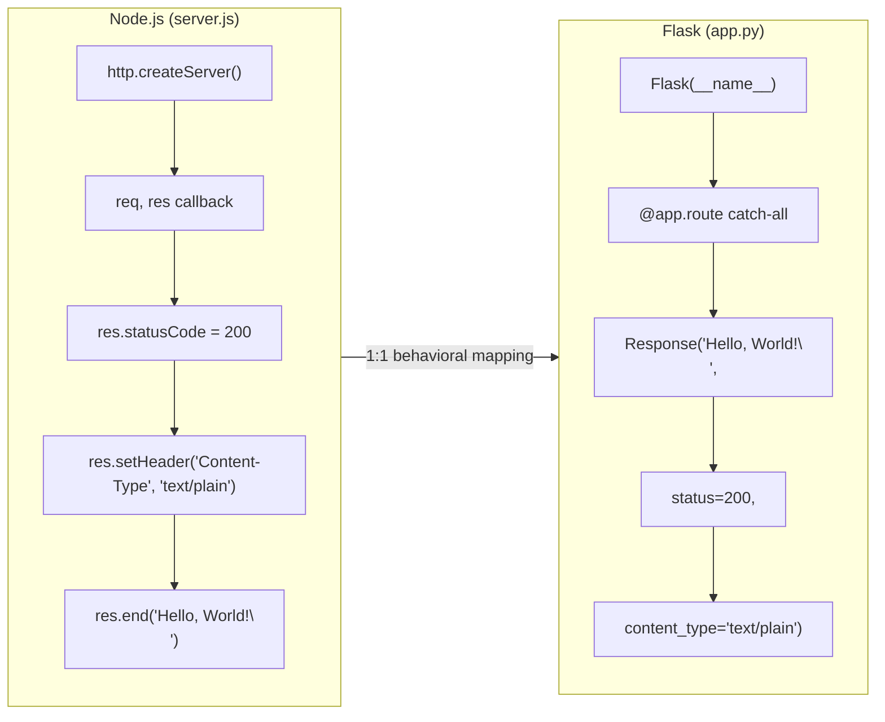

# Technical Specification

# 0. Agent Action Plan

## 0.1 Intent Clarification

### 0.1.1 Core Refactoring Objective

Based on the prompt, the Blitzy platform understands that the refactoring objective is to perform a **complete tech stack migration** of an existing Node.js HTTP server application into a Python 3 Flask application, with an absolute requirement for behavioral parity between the original and rewritten versions.

- **Refactoring type:** Tech stack migration (Node.js/JavaScript → Python 3/Flask)
- **Target repository:** Same repository — the Python Flask application replaces the Node.js implementation in-place
- **Behavioral contract:** Every feature and functionality in the original Node.js project must be preserved exactly in the rewritten Flask application, with no behavioral deviations permitted

The specific refactoring goals are:

- **G-001: HTTP Server Migration** — Replace the Node.js built-in `http` module server (`server.js`) with a Python 3 Flask application that provides identical HTTP server capabilities, binding to the same host (`127.0.0.1`) and port (`3000`)
- **G-002: Static Response Parity** — The Flask application must return an identical HTTP response for all inbound requests: status code `200`, header `Content-Type: text/plain`, and body `Hello, World!\n`
- **G-003: Startup Logging Parity** — The Flask application must log a startup message to the console upon successful server binding, replicating the behavior of the Node.js `console.log` callback in `server.listen()`
- **G-004: Request-Agnostic Handling** — The Flask application must handle all HTTP requests (regardless of method, path, headers, or body) identically, mirroring the Node.js handler's behavior of ignoring the `req` object entirely
- **G-005: Dependency Management Transition** — Replace the npm/`package.json` dependency management with Python's `requirements.txt` and pip-based dependency management, introducing Flask as the sole external dependency
- **G-006: Documentation Update** — Update `README.md` to reflect the new Python/Flask technology stack and execution instructions
- **G-007: Code Commentary** — Per the user-specified rule "Clone-23-march test," add a `# Testing` comment in all lines of the code

Implicit requirements surfaced through analysis:

- **API compatibility:** The rewritten server must respond identically at the HTTP protocol level — same status codes, same headers, same body content, same port binding
- **Preserve stateless behavior:** The Flask application must remain fully stateless, with no session management, database connections, or persistent state
- **Loopback binding:** The server must continue binding exclusively to `127.0.0.1`, not `0.0.0.0` or any external interface
- **Single-file simplicity:** The original architecture is a single-file server; the Flask rewrite should maintain minimal file count, aligned with the project's purpose as a minimal test fixture

### 0.1.2 Technical Interpretation

This refactoring translates to the following technical transformation strategy:

The migration replaces a 14-line Node.js CommonJS module that uses the built-in `http.createServer()` API with a Python 3 Flask application that uses Flask's routing and response mechanisms to achieve identical HTTP behavior. The transformation is a 1:1 technology swap at the runtime, language, and framework level while preserving the exact external-facing behavior.

**Architecture mapping (Current → Target):**

| Aspect | Current (Node.js) | Target (Python 3 Flask) |
|--------|-------------------|------------------------|
| Language | JavaScript (ES6+) | Python 3.12 |
| Runtime | Node.js v20.20.1 | Python 3.12.3 + Flask 3.1.3 |
| HTTP Module | Built-in `http` module | Flask (Werkzeug-based) |
| Module System | CommonJS (`require`) | Python imports (`from flask import Flask`) |
| Entry Point | `node server.js` | `python3 app.py` |
| Host Binding | `127.0.0.1` (hardcoded) | `127.0.0.1` (hardcoded) |
| Port | `3000` (hardcoded) | `3000` (hardcoded) |
| Response Body | `Hello, World!\n` | `Hello, World!\n` |
| Status Code | `200` | `200` |
| Content-Type | `text/plain` | `text/plain` |
| Startup Log | `console.log(...)` | `print(...)` |
| Package Manager | npm (`package.json`) | pip (`requirements.txt`) |
| Dependencies | Zero external | One external (Flask) |

**Transformation rules:**

- `require('http')` → `from flask import Flask, Response`
- `http.createServer((req, res) => {...})` → `@app.route('/', defaults={'path': ''})` with catch-all route
- `res.statusCode = 200` → Flask response with `status=200`
- `res.setHeader('Content-Type', 'text/plain')` → Flask `Response` with `content_type='text/plain'`
- `res.end('Hello, World!\n')` → `return Response('Hello, World!\n', ...)`
- `server.listen(port, hostname, callback)` → `app.run(host='127.0.0.1', port=3000)`
- `console.log(...)` → `print(...)` in Flask startup
- All Node.js-specific files (`package.json`, `package-lock.json`) → Python equivalents (`requirements.txt`)

## 0.2 Source Analysis

### 0.2.1 Comprehensive Source File Discovery

The repository is a minimal, single-directory Node.js project with exactly four files and zero subdirectories. Every file has been inspected via `read_file` and `get_source_folder_contents` to establish the complete source inventory.

**Discovery methods applied:**

- `get_source_folder_contents("")` — Enumerated all root-level children
- `read_file("server.js")` — Retrieved full application source (14 lines)
- `read_file("package.json")` — Retrieved npm manifest (11 lines)
- `read_file("package-lock.json")` — Retrieved lockfile (13 lines)
- `read_file("README.md")` — Retrieved documentation (2 lines)

**Complete source file inventory:**

| File | Lines | Size Role | Refactoring Action |
|------|-------|-----------|-------------------|
| `server.js` | 14 | Application logic — HTTP server using Node.js `http` module | **Replace** with `app.py` (Flask equivalent) |
| `package.json` | 11 | npm package manifest — metadata, scripts, license | **Replace** with `requirements.txt` (Python dependency manifest) |
| `package-lock.json` | 13 | npm lockfile — confirms zero external dependencies | **Remove** (no Python equivalent needed; pip freeze can regenerate) |
| `README.md` | 2 | Project documentation — name and purpose directive | **Update** to reflect Python/Flask stack and new execution instructions |

**Key observations from source analysis:**

- `server.js` is the **sole file containing executable logic** — it uses `require('http')` to create an HTTP server, binds to `127.0.0.1:3000`, and returns `Hello, World!\n` with a `200 OK` and `Content-Type: text/plain` for every request regardless of method or path
- `package.json` declares `"main": "index.js"` but no `index.js` exists — this entry-point mismatch is a pre-existing discrepancy in the original project and is irrelevant to the Flask migration
- `package-lock.json` confirms zero external npm dependencies — the `packages` map contains only the root package entry
- `README.md` identifies the project as `hao-backprop-test` with the directive "Do not touch!" — this documentation will be updated to reflect the new Python/Flask technology stack

### 0.2.2 Current Structure Mapping

```
Current:
(repository root)
├── server.js              (14 lines — complete HTTP server logic, CommonJS, Node.js http module)
├── package.json           (11 lines — npm metadata: name=hello_world, v1.0.0, MIT, zero dependencies)
├── package-lock.json      (13 lines — lockfileVersion 3, zero external packages)
└── README.md              (2 lines — project name and "Do not touch!" directive)
```

**server.js detailed breakdown:**

| Lines | Purpose | Flask Equivalent |
|-------|---------|-----------------|
| 1 | `const http = require('http');` — Import Node.js HTTP module | `from flask import Flask, Response` |
| 3–4 | `const hostname = '127.0.0.1'; const port = 3000;` — Server constants | `HOST = '127.0.0.1'` and `PORT = 3000` |
| 6–10 | Request handler callback — sets status 200, Content-Type text/plain, body "Hello, World!\n" | Flask route handler returning `Response(...)` |
| 12–14 | `server.listen(...)` with startup log callback | `app.run(host=HOST, port=PORT)` with `print(...)` |

**package.json key fields:**

| Field | Value | Migration Impact |
|-------|-------|-----------------|
| `name` | `hello_world` | Informational — reflected in `requirements.txt` comment |
| `version` | `1.0.0` | Informational — no Python equivalent needed |
| `description` | `Hello world in Node.js` | Update to "Hello world in Python/Flask" in README |
| `main` | `index.js` | Replaced by `app.py` as the entry point |
| `scripts.test` | `echo "Error: no test specified" && exit 1` | No equivalent needed — placeholder only |
| `author` | `hxu` | Preserved in documentation |
| `license` | `MIT` | Preserved — add LICENSE reference if needed |

## 0.3 Scope Boundaries

### 0.3.1 Exhaustively In Scope

**Source transformations:**

- `server.js` — Full replacement with `app.py` (Flask application)
- `package.json` — Replaced by `requirements.txt` (Python dependency manifest)
- `package-lock.json` — Removed entirely (no Python equivalent required)

**New file creation:**

- `app.py` — Flask application implementing all features from `server.js`
- `requirements.txt` — Python dependency file declaring Flask==3.1.3

**Documentation updates:**

- `README.md` — Update to reflect the Python 3/Flask technology stack, new execution instructions (`python3 app.py` instead of `node server.js`), and updated project description

**Behavioral contracts preserved (all must pass verification):**

- HTTP server binds to `127.0.0.1:3000`
- All HTTP requests (any method, any path, any headers, any body) receive identical response
- Response status code: `200`
- Response header: `Content-Type: text/plain`
- Response body: `Hello, World!\n` (exactly 15 bytes including trailing newline)
- Startup log message printed to stdout upon successful server binding

**Code commentary requirement (per user rule "Clone-23-march test"):**

- Every line of generated Python code must include a `# Testing` comment

### 0.3.2 Explicitly Out of Scope

Based on the user instruction "Make minimal changes: Confine all changes to the defined scope and nowhere else," the following items are explicitly out of scope:

| Category | Excluded Element | Rationale |
|----------|-----------------|-----------|
| Routing | URL path-based routing or method filtering | Original Node.js server treats all requests identically |
| Request Parsing | Body, header, query parameter, or form data parsing | Original server ignores the `req` object entirely |
| Authentication | Any form of auth or access control | Not present in original |
| Error Handling | Custom error pages or exception handlers beyond Flask defaults | Not present in original |
| Configuration | Environment variable support or config files | Original uses hardcoded constants only |
| Persistence | Database, file storage, caching, or session management | Original is fully stateless |
| Testing Framework | pytest, unittest, or other test frameworks | Original has no test suite (placeholder only) |
| Containerization | Dockerfile, Docker Compose, or container configurations | Not present in original |
| CI/CD | GitHub Actions, pipelines, or deployment scripts | Not present in original |
| Build System | Makefile, setup.py, pyproject.toml, or build tooling | Not required for this minimal application |
| Type Hints | Python type annotations or mypy configuration | Not required to match original behavior |
| Logging Framework | Python `logging` module or structured logging | Original uses only `console.log` (mapped to `print`) |
| HTTPS/TLS | SSL certificate support or HTTPS configuration | Not present in original |
| Virtual Environment | `venv` or `virtualenv` configuration files | Deployment detail, not application scope |
| WSGI Server | Gunicorn, uWSGI, or production WSGI server configuration | Original uses development server only |
| Additional Routes | Any routes beyond the catch-all handler | Original has no routing |
| API Documentation | OpenAPI/Swagger specifications | Not present in original |
| Linting/Formatting | flake8, black, pylint, or other code quality tools | Not required for behavioral parity |

## 0.4 Target Design

### 0.4.1 Refactored Structure Planning

The target structure replaces the Node.js project files with their Python/Flask equivalents while maintaining the same minimal, single-directory architecture appropriate for this test fixture project.

```
Target:
(repository root)
├── app.py                 (Flask application — replaces server.js)
├── requirements.txt       (Python dependencies — replaces package.json)
└── README.md              (Updated documentation — reflects Python/Flask stack)
```

**File-by-file rationale:**

| Target File | Replaces | Purpose |
|------------|----------|---------|
| `app.py` | `server.js` | Flask application implementing HTTP server with identical behavior: binds to `127.0.0.1:3000`, returns `Hello, World!\n` with status 200 and `Content-Type: text/plain` for all requests, logs startup message |
| `requirements.txt` | `package.json` + `package-lock.json` | Declares Flask==3.1.3 as the sole dependency, equivalent to npm's zero-external-dependency stance but now with Flask as the required framework |
| `README.md` | `README.md` (updated) | Updated project documentation reflecting the Python/Flask technology stack and new execution instructions |

**Files removed (no target equivalent):**

| Removed File | Reason |
|-------------|--------|
| `server.js` | Replaced by `app.py` |
| `package.json` | Replaced by `requirements.txt` |
| `package-lock.json` | No Python equivalent needed; pip manages dependencies via `requirements.txt` |

### 0.4.2 Web Search Research Conducted

The following research was conducted to inform the target design decisions:

- **Flask latest stable version:** Confirmed Flask 3.1.3 (released February 19, 2026) as the latest stable release on PyPI, compatible with Python 3.12
- **Flask minimal application pattern:** The standard Flask "Hello, World!" pattern uses `Flask(__name__)` application factory, `@app.route()` decorator for routing, and `app.run()` for development server startup
- **Flask catch-all routing:** To match the Node.js server's behavior of responding identically to all requests regardless of path, Flask's catch-all route pattern `@app.route('/', defaults={'path': ''})` combined with `@app.route('/<path:path>')` captures all URL paths
- **Flask response customization:** The `Response` class from Flask (or `make_response`) allows explicit control over status code, content type, and body content to achieve exact parity with the Node.js implementation
- **Flask host and port binding:** `app.run(host='127.0.0.1', port=3000)` mirrors the Node.js `server.listen(3000, '127.0.0.1')` binding behavior

### 0.4.3 Design Pattern Applications

Given the extreme simplicity of this application (a single static-response HTTP server), minimal design patterns are applicable:

- **Single-module pattern:** The entire application resides in a single file (`app.py`), mirroring the original `server.js` single-file architecture. This maintains the project's purpose as a minimal test fixture
- **Catch-all route pattern:** A Flask catch-all route (`/<path:path>`) ensures all HTTP requests are handled by a single function, replicating the Node.js `http.createServer` callback that receives all requests regardless of path
- **Explicit response construction:** Using Flask's `Response` object with explicit `status`, `content_type`, and body parameters ensures exact control over the HTTP response, matching the Node.js `res.statusCode`, `res.setHeader()`, and `res.end()` pattern
- **Direct execution pattern:** The `if __name__ == '__main__':` guard with `app.run()` provides the standard Python entry point, equivalent to the Node.js module-level execution pattern

### 0.4.4 User Interface Design

Not applicable. This project is a headless HTTP server with no user interface, no HTML rendering, no templates, and no frontend assets. The sole interface is the HTTP protocol-level request/response exchange, which is preserved identically in the Flask rewrite.

## 0.5 Transformation Mapping

### 0.5.1 File-by-File Transformation Plan

The following table maps every target file to its source, transformation mode, and key changes. The entire refactor is executed in **one phase** — no multi-phase splitting is permitted.

| Target File | Transformation | Source File | Key Changes |
|------------|---------------|-------------|-------------|
| `app.py` | CREATE | `server.js` | Rewrite Node.js HTTP server as Python 3 Flask application; implement catch-all route returning `Hello, World!\n` with status 200 and `Content-Type: text/plain`; bind to `127.0.0.1:3000`; add startup print message; add `# Testing` comment on every line per user rule |
| `requirements.txt` | CREATE | `package.json` | Create Python dependency manifest declaring `Flask==3.1.3` as the sole dependency; replaces npm metadata with pip-compatible format |
| `README.md` | UPDATE | `README.md` | Update project description to reflect Python 3/Flask stack; change execution instructions from `node server.js` to `python3 app.py`; update dependency installation from implicit (zero npm deps) to `pip install -r requirements.txt`; preserve project name `hao-backprop-test` |
| `server.js` | REMOVE | `server.js` | Remove original Node.js server file — replaced by `app.py` |
| `package.json` | REMOVE | `package.json` | Remove npm manifest — replaced by `requirements.txt` |
| `package-lock.json` | REMOVE | `package-lock.json` | Remove npm lockfile — no longer applicable in Python ecosystem |

### 0.5.2 Cross-File Dependencies

**Import statement transformations:**

The original Node.js project has exactly one import statement in `server.js`:

- **FROM (Node.js):** `const http = require('http');`
- **TO (Python/Flask):** `from flask import Flask, Response`

No other import statements exist in the repository. No cross-file imports exist (the project is single-file).

**Configuration updates for new structure:**

| Configuration Aspect | Original (Node.js) | Target (Python/Flask) |
|---------------------|--------------------|-----------------------|
| Dependency declaration | `package.json` (zero deps) | `requirements.txt` (Flask==3.1.3) |
| Dependency lock | `package-lock.json` | Not needed (single pinned dependency) |
| Entry point | `node server.js` | `python3 app.py` |
| Package metadata | `package.json` fields (name, version, description, author, license) | Preserved in `README.md` only — no `setup.py` or `pyproject.toml` needed |

**Response behavior mapping (critical for behavioral parity):**



### 0.5.3 Wildcard Patterns

Given the minimal repository structure (4 files, zero subdirectories), no wildcard patterns are necessary. All files are explicitly enumerated:

- **Source files affected:** `server.js`, `package.json`, `package-lock.json`, `README.md`
- **Target files produced:** `app.py`, `requirements.txt`, `README.md`

No trailing wildcard patterns (e.g., `src/**/*.py`) are applicable because no subdirectories exist.

### 0.5.4 One-Phase Execution

The entire refactoring operation is executed in a **single phase**. There are no intermediate states, no partial migrations, and no phased rollout. The transformation is atomic:

- Remove all three Node.js files (`server.js`, `package.json`, `package-lock.json`)
- Create both new Python files (`app.py`, `requirements.txt`)
- Update `README.md`

All six file operations are performed in one pass.

## 0.6 Dependency Inventory

### 0.6.1 Key Private and Public Packages

The original Node.js project has **zero external dependencies** — it relies exclusively on the Node.js built-in `http` module. The Flask migration introduces one direct dependency (Flask) and its transitive dependencies.

**Original dependencies (Node.js — being removed):**

| Package Registry | Name | Version | Purpose |
|-----------------|------|---------|---------|
| Node.js built-in | `http` | Bundled with Node.js v20.20.1 | HTTP server creation and request handling |
| Node.js built-in | `console` | Bundled with Node.js v20.20.1 | Startup logging |

**Target dependencies (Python/Flask — being added):**

| Package Registry | Name | Version | Purpose |
|-----------------|------|---------|---------|
| PyPI | `Flask` | 3.1.3 | Web application framework — provides HTTP routing, request handling, and response construction |
| PyPI | `Werkzeug` | 3.1.7 | WSGI utility library — transitive dependency of Flask; provides the development HTTP server |
| PyPI | `Jinja2` | 3.1.6 | Template engine — transitive dependency of Flask (not used directly in this application) |
| PyPI | `MarkupSafe` | 3.0.3 | String escaping — transitive dependency of Jinja2 (not used directly) |
| PyPI | `itsdangerous` | 2.2.0 | Data signing — transitive dependency of Flask (not used directly) |
| PyPI | `click` | 8.3.1 | CLI toolkit — transitive dependency of Flask (not used directly) |
| PyPI | `blinker` | 1.9.0 | Signal support — transitive dependency of Flask (not used directly) |

All versions listed above were verified by installing Flask 3.1.3 in the project environment using `python3 -m pip install Flask==3.1.3` and confirming the resolved transitive dependency versions.

**`requirements.txt` content (to be created):**

Only the direct dependency is pinned in the requirements file:

```
Flask==3.1.3
```

Transitive dependencies are automatically resolved by pip during installation and do not need to be listed in `requirements.txt` for this minimal project.

### 0.6.2 Dependency Updates

**Import refactoring:**

Since the project consists of a single source file and the migration creates a new file (`app.py`) rather than modifying existing Python files, there are no pre-existing import statements to update. The transformation is:

- **Removed import:** `const http = require('http');` (in `server.js`, deleted)
- **New import:** `from flask import Flask, Response` (in `app.py`, created)

**External reference updates:**

| File | Update Required | Details |
|------|----------------|---------|
| `README.md` | Yes | Update execution instructions from `node server.js` to `pip install -r requirements.txt && python3 app.py` |
| `requirements.txt` | New file | Created with `Flask==3.1.3` |
| `package.json` | Removed | No longer applicable |
| `package-lock.json` | Removed | No longer applicable |

**Runtime transition:**

| Aspect | Original | Target |
|--------|----------|--------|
| Runtime | Node.js v20.20.1 | Python 3.12 |
| Package manager | npm v11.1.0 | pip |
| Install command | Not needed (zero deps) | `pip install -r requirements.txt` |
| Run command | `node server.js` | `python3 app.py` |
| Framework | None (built-in `http`) | Flask 3.1.3 |

## 0.7 Testing

This section is included per the user-specified rule **"Clone-23-march test"**, which states: *"add a section Testing in Agent action plan"* and *"In the code add comment Testing in all lines of the code."*

### 0.7.1 Code Comment Requirement

Per the user rule, every line of generated Python code in the rewritten Flask application (`app.py`) must include a `# Testing` comment. This applies to:

- All import statements
- All variable/constant declarations
- All function definitions
- All route decorator lines
- All response construction lines
- All `app.run()` and conditional `__main__` lines
- All blank lines should include the comment where syntactically appropriate

**Example pattern for `app.py`:**

```python
from flask import Flask, Response  # Testing
app = Flask(__name__)  # Testing
```

This comment convention serves as a traceability marker for the testing/QA pipeline and must be applied consistently across every line of generated code.

### 0.7.2 Behavioral Verification Criteria

Although no formal test framework is in scope (the original project had no test suite), the rewritten Flask application must satisfy the following behavioral verification criteria to confirm feature parity:

**HTTP response verification:**

- **Method:** Send GET, POST, PUT, DELETE, PATCH, HEAD, and OPTIONS requests to `http://127.0.0.1:3000/`
- **Expected:** All requests return status `200`, `Content-Type: text/plain`, and body `Hello, World!\n`
- **Verification command:** `curl -s http://127.0.0.1:3000/` should output `Hello, World!`

**Path-agnostic verification:**

- **Method:** Send requests to arbitrary paths such as `/foo`, `/bar/baz`, `/nonexistent`
- **Expected:** All paths return the identical response
- **Verification command:** `curl -s http://127.0.0.1:3000/any/path/here` should output `Hello, World!`

**Startup log verification:**

- **Method:** Start the Flask server and capture stdout
- **Expected:** A startup message is printed indicating the server is running, including the host and port

**Port binding verification:**

- **Method:** After starting the server, verify port 3000 is in use on the loopback interface
- **Verification command:** `lsof -i :3000` or `ss -tlnp | grep 3000`

### 0.7.3 Testing Traceability

| Verification | Original Behavior (Node.js) | Expected Behavior (Flask) | Status |
|-------------|----------------------------|--------------------------|--------|
| Response body | `Hello, World!\n` | `Hello, World!\n` | Must match exactly |
| Status code | `200` | `200` | Must match exactly |
| Content-Type | `text/plain` | `text/plain` | Must match exactly |
| Bind address | `127.0.0.1:3000` | `127.0.0.1:3000` | Must match exactly |
| Startup log | `Server running at http://127.0.0.1:3000/` | Equivalent startup message | Must print to stdout |
| Request-agnostic | All methods/paths return same response | All methods/paths return same response | Must match behavior |
| `# Testing` comment | N/A | Present on every code line | Per user rule |

## 0.8 Refactoring Rules

### 0.8.1 Refactoring-Specific Rules

The following rules are explicitly derived from the user's provided implementation rules and must be enforced throughout the refactoring process:

**Rule 1 — RULE-SK-24-march (Full Feature Parity):**

> User Example: "Rewrite this Node.js server into a Python 3 Flask application, keeping every feature and functionality exactly as in the original Node.js project. Ensure the rewritten version fully matches the behavior and logic of the current implementation."

- The Flask application must replicate every observable behavior of the Node.js server
- No features may be added, removed, or modified during the rewrite
- The HTTP protocol-level interface must be indistinguishable between the original and rewritten versions
- Response body, status code, content type, and port binding must be byte-exact matches

**Rule 2 — Make Minimal Changes (Scope Confinement):**

> User Example: "Confine all changes to the defined scope and nowhere else. Maintain all public interfaces, side effects, data flows, and dependencies unless the spec explicitly mandates adjustments. Do not refactor opportunistically. Avoid cascading changes, cross-file edits, or global updates. Changes must be minimal, isolated, and fully aligned with the scoped objective."

- Changes are strictly limited to the four files defined in scope (`server.js` → `app.py`, `package.json` → `requirements.txt`, `package-lock.json` removal, `README.md` update)
- No opportunistic refactoring — do not add features, patterns, or improvements not present in the original
- No cascading changes — the project has no external consumers or downstream dependencies
- The public interface (HTTP endpoint behavior) must remain identical
- Side effects (startup console log) must be preserved

**Rule 3 — Clone-23-march test (Testing Commentary):**

> User Example: "add a section Testing in Agent action plan. In the code add comment Testing in all lines of the code"

- A dedicated "Testing" section (0.7) has been added to this Agent Action Plan
- Every line of generated Python code must include a `# Testing` comment
- This applies to all code in `app.py` without exception

### 0.8.2 Special Instructions and Constraints

**Migration-specific constraints:**

- The rewrite is an in-place tech stack migration within the same repository — not a migration to a new repository
- The Flask development server (`app.run()`) is the target execution mode, consistent with the original Node.js development server approach
- No production WSGI server (Gunicorn, uWSGI) is required
- The Flask `debug` mode should remain off (no `debug=True`) to match the original Node.js server's non-debug behavior

**Behavioral preservation requirements:**

- The catch-all route must handle ALL HTTP methods (GET, POST, PUT, DELETE, PATCH, HEAD, OPTIONS, etc.) identically
- The catch-all route must handle ALL URL paths (including `/`, `/foo`, `/bar/baz/qux`) identically
- The response body must be exactly `Hello, World!\n` (with trailing newline character)
- The Content-Type must be exactly `text/plain` (not `text/plain; charset=utf-8` or any variant, unless Flask's default behavior produces a compatible result)
- The server must bind exclusively to `127.0.0.1` (loopback), not `0.0.0.0` (all interfaces)

**Code quality constraints:**

- The Flask application should be a single file (`app.py`) to maintain the original single-file simplicity
- No unnecessary abstractions, classes, or design patterns beyond what is required for the Flask framework
- Python code should follow standard PEP 8 conventions where they do not conflict with the `# Testing` comment requirement

## 0.9 References

### 0.9.1 Codebase Files and Folders Searched

The following files and folders were comprehensively searched and retrieved during the analysis to derive the conclusions in this Agent Action Plan:

| Path | Type | Tool Used | Purpose |
|------|------|-----------|---------|
| `` (repository root) | Folder | `get_source_folder_contents` | Enumerate all root-level children; confirmed 4 files, 0 subdirectories |
| `server.js` | File | `read_file` (lines 1–14) | Retrieved complete application source code; analyzed HTTP server logic, host/port binding, response handler, and startup log |
| `package.json` | File | `read_file` (lines 1–11) | Retrieved npm manifest; confirmed package name (`hello_world`), version (`1.0.0`), zero dependencies, MIT license, and author (`hxu`) |
| `package-lock.json` | File | `read_file` (lines 1–13) | Retrieved lockfile; confirmed lockfileVersion 3 with zero external packages |
| `README.md` | File | `read_file` (lines 1–2) | Retrieved documentation; confirmed project name (`hao-backprop-test`) and "Do not touch!" directive |

**No `.blitzyignore` files were found** in the repository (verified via `find / -name ".blitzyignore"` — no results).

### 0.9.2 Technical Specification Sections Retrieved

The following sections from the existing Technical Specification were consulted for context:

| Section | Key Information Extracted |
|---------|-------------------------|
| 1.1 Executive Summary | Project purpose as Backprop integration test fixture; minimal architecture description; stakeholder identification |
| 1.3 Scope | In-scope features (HTTP server, static response, startup logging); out-of-scope items (routing, auth, persistence, CI/CD) |
| 2.1 Feature Catalog | Feature inventory (F-001 through F-004); feature metadata and dependencies |
| 2.2 Functional Requirements | Detailed requirements for each feature including acceptance criteria and validation rules |
| 3.1 Technology Stack Overview | Current stack: Node.js v20.20.1, npm v11.1.0, built-in `http` module only |
| 3.2 Programming Languages | JavaScript/Node.js analysis; CommonJS module system; ES6+ syntax |
| 3.3 Frameworks and Libraries | Confirmed zero external frameworks; sole dependency is Node.js built-in `http` module |
| 5.1 High-Level Architecture | Monolithic single-file architecture; synchronous request-response pattern; data flow description |

### 0.9.3 Web Searches Conducted

| Search Query | Key Finding |
|-------------|-------------|
| "Flask latest stable version 2024 2025" | Flask 3.1.3 is the latest stable release (Feb 19, 2026) on PyPI; Flask 3.1.x series is production-stable; requires Python 3.9+ |

### 0.9.4 Environment Verification

| Component | Version Verified | Method |
|-----------|-----------------|--------|
| Node.js | v20.20.1 | `node --version` |
| npm | v11.1.0 | `npm --version` |
| Python 3 | 3.12.3 | `python3 --version` |
| pip | 25.3 | `pip3 --version` |
| Flask | 3.1.3 | `python3 -c "import flask; ..."` after installation |
| Werkzeug | 3.1.7 | Resolved as Flask transitive dependency |
| Jinja2 | 3.1.6 | Resolved as Flask transitive dependency |
| MarkupSafe | 3.0.3 | Resolved as Flask transitive dependency |
| itsdangerous | 2.2.0 | Resolved as Flask transitive dependency |
| click | 8.3.1 | Resolved as Flask transitive dependency |
| blinker | 1.9.0 | Resolved as Flask transitive dependency |

### 0.9.5 User-Provided Attachments and Metadata

- **Attachments:** No attachments were provided for this project
- **Figma URLs:** No Figma URLs were specified
- **Environment files:** No environment files were provided in `/tmp/environments_files/`
- **Environment variables:** None specified
- **Secrets:** None specified

### 0.9.6 User-Provided Implementation Rules

| Rule Name | Summary |
|-----------|---------|
| RULE-SK-24-march | Rewrite Node.js server into Python 3 Flask with full feature and behavior parity |
| Make minimal changes | Confine all changes to defined scope; maintain public interfaces; no opportunistic refactoring |
| Clone-23-march test | Add Testing section to Agent Action Plan; add `# Testing` comment in all lines of generated code |

